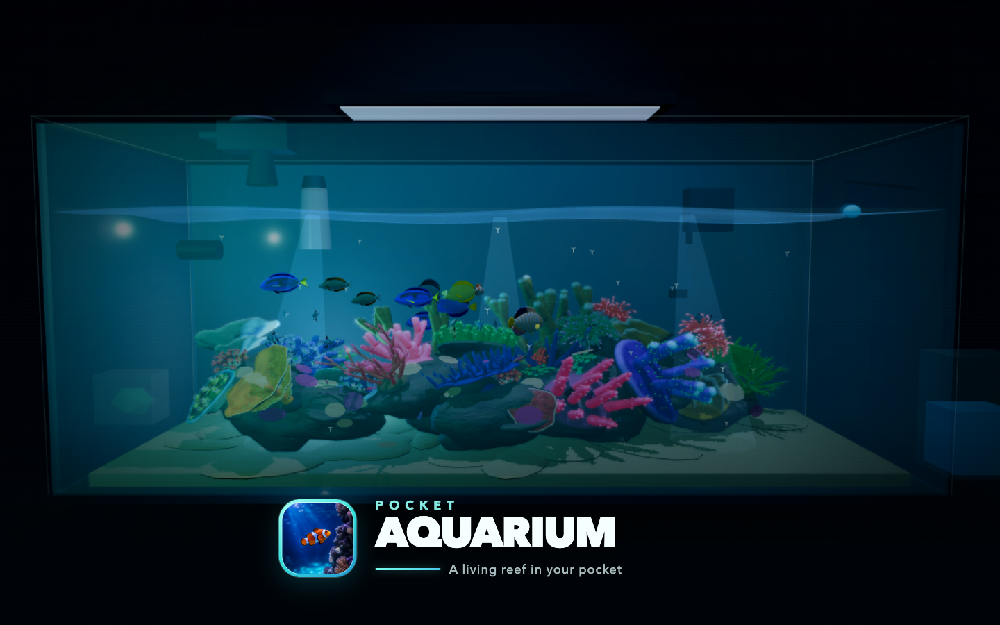

# Pocket Aquarium store listing

## App name

Pocket Aquarium

## Subtitle

A living reef in your pocket

## Promotional text

Build your dream aquarium, care for real species, and watch a complete underwater ecosystem grow and respond to every choice you make.

## Full description

**What if your phone held a living ocean?**

Pocket Aquarium lets you build the aquarium you have always dreamed about. Create a vibrant coral reef or freshwater ecosystem, choose real fish and plants, arrange every rock and coral, then watch your tank grow, change, and respond to the choices you make.

Every inhabitant has its own needs and natural behaviors. Gobies sift sand, tangs graze algae, shrimp clean fish, plants spread, and corals flourish under the right conditions. Build a peaceful community, raise a breathtaking reef, or attempt a massive showpiece tank filled with life.

**Your tank. Your ecosystem. Your story.**

- Build saltwater and freshwater aquariums.
- Collect fish, corals, plants, and invertebrates.
- Design custom rockscapes and planted layouts.
- Watch inhabitants behave like their real-world counterparts.
- Feed, maintain, trim, clean, and care for your ecosystem.
- Discover compatibility, temperament, and habitat requirements.
- Grow a small starter tank into an unforgettable aquatic world.

There is no single correct aquarium. Create something peaceful, strange, beautiful, or completely wild.

**Download Pocket Aquarium and put a living world in your pocket.**

## Google Play short description

Build your dream aquarium and watch a living underwater ecosystem grow.

## Primary landscape hero

