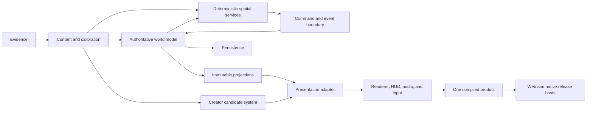

# Foundation and Architecture

This chapter defines the reusable architecture for a detailed simulation-rich game. It establishes the mental model, ownership boundaries, core schemas, deterministic time, persistence, authoring boundaries, and promotion gates that later chapters implement.

The universal method comes first. Pocket Aquarium appears afterward as observed evidence. Freshwater and wizard examples demonstrate transfer only.

## 1. The mental model

A simulation-rich game is not one program loop with increasingly elaborate visuals. It is a chain of authorities:

```text
evidence
  -> content and calibration
  -> authoritative world transitions
  -> deterministic spatial resolution
  -> typed events and immutable projections
  -> presentation adapters
  -> renderer, audio, HUD, and input surfaces
  -> ordered persistence and immutable release artifacts
```

The central question is not "where is this value convenient to compute?" It is "can this fact change a later legal action, outcome, progression state, save, or replay?" If yes, it is **Gameplay Truth** and MUST have one authoritative owner inside the deterministic world boundary.

Camera position, hover state, interpolation, decorative particles, and uncommitted previews are display facts. They MAY remain presentation-local because they cannot change the world.

### Recommended reusable method: six architecture laws

1. **One fact, one authority.** A gameplay fact MUST not have competing mutable copies in the renderer, HUD, editor, and world model.
2. **One cause, one causal clock.** Gameplay consequences MUST advance on fixed simulation ticks. Render frames MUST NOT decide contact, damage, resource use, growth, death, compatibility, or progression.
3. **Commands in, events out.** Product surfaces MUST submit typed intents. The world MUST return committed state and typed events.
4. **Projection, not duplication.** Every scene, HUD, accessibility view, inspector, and debug overlay MUST consume a read-only projection.
5. **Content is not state.** Profiles define what an entity can be. Serializable instances define what it is doing now.
6. **Promotion is explicit.** A candidate, an approval, a runtime default, and a published release MUST be separate states.

## 2. Exact vocabulary

| Term | Meaning | It MUST NOT mean |
|---|---|---|
| `World Model` | Serializable state and deterministic transitions for gameplay-relevant facts | Renderer component state |
| `Gameplay Truth` | A fact that can affect a later action, outcome, progression, persistence, or replay | Camera, hover, particles, or interpolation |
| `Player Intent` | A typed request validated at the authority boundary | Direct mutation from a button or mesh |
| `Domain Event` | A typed record emitted by a committed transition, with tick and entity identities | An unverified renderer callback |
| `Simulation Tick` | One fixed causal update with an ordered phase list | A render frame |
| `Presentation Tick` | Frame-time interpolation and display update without gameplay authority | A place to resolve consequential contact |
| `Projection` | An immutable derived view for a named consumer | A second economy, lifecycle, or physics model |
| `Content Profile` | Stable identity that references evidence, calibration, behavior, physics, lifecycle, compatibility, and assets | Mutable instance state |
| `Evidence Profile` | Versioned source claims, measurements, provenance, confidence, and inference labels | Gameplay tuning |
| `Calibration Profile` | Versioned rates, thresholds, probabilities, and accelerations derived from evidence plus design intent | Literal real-world fact |
| `Typicality Contract` | Declared ranges and invariants for characteristic shape, scale, posture, motion, habitat, interaction, and response | A claim that every individual behaves identically |
| `Physical Envelope` | Collision, support, clearance, speed, and turning constraints used by spatial services | A visual bounding sphere inferred at runtime |
| `Presentation Asset` | Immutable mesh, material, rig, local clips, LODs, and attachment metadata | Identity, welfare, compatibility, or world route |
| `Runtime Adapter` | Mapping from realized kinematics and events to asset-local pose, clips, materials, and conformance | A gameplay decision-maker |
| `Candidate` | An immutable asset or calibration hypothesis with a unique digest and receipts | Approved or promoted content |
| `Workbench` | Runtime-equivalent isolated inspection and bounded authoring surface | The player scene |
| `Showcase` | A deterministic nonpersistent fixture using player mechanics and promoted assets | A second game engine |
| `Draft Edit` | A reversible, uncommitted change | Saved or promoted state |
| `Surface Ready` | Earliest honest usable entrypoint with limitations disclosed | Final completion |

Use these orthogonal lifecycle fields instead of a bare `accepted` flag:

```ts
type CandidateStatus =
  | 'draft'
  | 'source_valid'
  | 'runtime_valid'
  | 'deterministic'
  | 'rejected'
  | 'superseded'

type VisualApprovalStatus =
  | 'not_reviewed'
  | 'approved'
  | 'rejected'
  | 'revoked'

type RuntimePromotionStatus =
  | 'not_promoted'
  | 'promoted_nondefault'
  | 'promoted_default'
  | 'rolled_back'

type ReleaseStatus =
  | 'built'
  | 'ci_verified'
  | 'device_verified'
  | 'signed_internal'
  | 'store_candidate'
  | 'published'
  | 'rolled_back'
```

## 3. Layered reference architecture

| Layer | Owns | Inputs | Outputs | MUST NOT own |
|---|---|---|---|---|
| L0. Evidence and design sources | Provenance, measurements, permissions, confidence, design references | Primary sources and design decisions | Versioned evidence profiles | Live tuning or runtime state |
| L1. Content and calibration catalog | IDs, archetypes, tuning, compatibility, lifecycle, behavior and asset references | Evidence plus balance decisions | Validated content profiles | Mutable instances |
| L2. Authoritative world model | Environment, resources, economy, lifecycle, welfare, inventory, relationships, entity spatial continuation, RNG, clocks | Intents, content, prior state | New state and typed events | Camera, hover, interpolation |
| L3. Deterministic spatial services | Static collision, support graph, neighbor index, reduced-order fields, swept contact | Hardscape revision, entity state, physical envelopes | Safe velocity, pose, contact, support samples | Decorative motion |
| L4. Command and event boundary | Intent validation, rejection reasons, exactly-once event application | UI and tool intents, world and spatial contact | Committed transitions and event log | Ad hoc render mutations |
| L5. Projection and query layer | Player, scene, HUD, accessibility, analytics, and debug views | State and event log | Immutable snapshots | Independent mechanics or persistence |
| L6. Presentation adapter | Axis conversion, root-motion policy, semantic clip mapping, playback, turn and conformance signals | Realized kinematics, events, presentation assets | Asset-local pose and material parameters | World path or welfare |
| L7. Renderer and product surfaces | Scene draw, HUD, camera, audio, particles, input collection, layout | Projections and adapter outputs | Pixels, sound, and typed intents | Consequential contact or gameplay truth |
| L8. Persistence coordinator | Schema, migration, sanitation, save ordering, offline policy, content and collision revisions | Committed world state and platform storage | Ordered saves and restores | Alternate simulation rules |
| L9. Creator candidate system | Evidence-aware editing, deterministic builds, validation, workbench review, approval and promotion transactions | Evidence and content contracts, pinned tools | Immutable candidates and receipts | Silent runtime mutation |
| L10. Release and operations | Build digest, web and native staging, CI, device and store gates, rollout and rollback ownership | One accepted compiled product | Immutable release artifacts and receipts | Platform-specific gameplay forks |

### Dependency direction



No arrow may run from pixels, camera, clip phase, hover state, or an uncommitted workbench preview directly into Gameplay Truth.

## 4. Authority test

For every new field, ask these questions in order:

1. Can the value change a later legal action, consequence, progression result, save, or replay?
2. Does it need to survive reload, device suspension, another view, or content migration?
3. Can two computers with the same initial state and intents compute it identically?
4. Which layer validates it, changes it, projects it, and displays it?
5. Which test proves there is no competing owner?

If question 1 is yes, the field MUST live in or be deterministically reconstructable by L2 through L4. If only display changes, it SHOULD remain in L5 through L7. If the answer is unclear, record an architecture decision before implementation.

### Authority matrix template

| Fact | Authority | Mutation path | Persisted or reconstructed | Projection consumers | Forbidden writers |
|---|---|---|---|---|---|
| Entity health | World model | Domain event reducer | Persisted | HUD, materials, analytics | Renderer, asset clip |
| World position | Spatial world state | Fixed spatial tick | Project decision required | Scene, audio, inspector | Mesh component |
| Hover target | UI surface | Pointer or focus event | No | HUD only | World model |
| Candidate digest | Creator system | Immutable build | Persisted receipt | Workbench, promotion service | Player scene |

### Fidelity selection contract

Realism is not the maximum amount of physics the hardware can run. It is the minimum model that preserves the causes, constraints, and consequences players can perceive or act upon.

Every environment or physics service MUST declare:

| Declaration | Required answer |
|---|---|
| Units and dimensionality | Meters, seconds, liters, degrees, or other explicit units; 2D, 2.5D, or 3D |
| Gameplay consumers | Which transitions, contacts, lifecycle rules, or actions use the result |
| Presentation consumers | Which shaders, particles, audio, or secondary motion use the result |
| Integration | Fixed step, substeps, numerical caps, and stability policy |
| Preserved behavior | The causal or perceptual effect the model must reproduce |
| Known omissions | Effects the model intentionally does not claim to simulate |
| Validation | Bounds, conservation or mass balance, deterministic scenarios, and device budget |

A reduced-order field MAY be authoritative when it reproduces the required consequence deterministically and its limits are explicit. A richer visual field MAY decorate that result, but it MUST NOT silently change gameplay. Full fluid, cloth, soft-body, or rigid-body simulation SHOULD be introduced only when a cheaper model fails a named player-visible requirement.

## 5. Core data contracts

Schemas SHOULD be plain, serializable, versioned, and independent of the rendering framework. Content and evidence records MUST be immutable at runtime. Mutable instance state MUST reference stable content identities.

### Content, evidence, and calibration

```ts
interface ContentProfile {
  schemaVersion: string
  id: string
  displayName: string
  canonicalName?: string
  category: 'animal' | 'plant' | 'creature' | 'character' | 'prop' | 'system'
  bodyPlanId: string
  variants: VariantDefinition[]
  evidence: EvidenceProfileRef
  calibration: CalibrationProfileRef
  environment: EnvironmentEnvelope
  lifecycle: LifecycleProfile
  compatibility: CompatibilityProfile
  behavior: BehaviorPolicyRef
  physics: PhysicalEnvelope
  presentation: PresentationAssetRef[]
  progression: ProgressionProfile
  provenanceRevision: string
}

interface EvidenceProfile {
  schemaVersion: string
  subjectId: string
  sources: Array<{
    id: string
    uri: string
    accessedAt: string
    licenseOrPermission: string
    evidenceClass: string
  }>
  measurements: Array<{
    name: string
    value: number
    unit: string
    populationOrStage: string
    confidence: 'high' | 'medium' | 'low' | 'inferred'
    sourceIds: string[]
  }>
  typicality: TypicalityContract
  assumptions: string[]
  contradictions: string[]
  evidenceDigest: string
}

interface CalibrationProfile {
  schemaVersion: string
  subjectId: string
  evidenceDigest: string
  gameTimeScale: number
  rates: Record<string, number>
  thresholds: Record<string, number>
  probabilities: Record<string, number>
  difficultyModifiers: Record<string, number>
  rationale: Record<string, string>
  calibrationDigest: string
}
```

An evidence profile records what sources support. A calibration profile records what the game does. The calibration MAY accelerate growth, exaggerate response, or compress travel, but its rationale MUST say so. A balance update MUST NOT silently rewrite the evidence digest.

### Environment, lifecycle, compatibility, and typicality

```ts
interface EnvironmentEnvelope {
  regions: string[]
  medium?: string
  temperature?: Range
  chemistry?: Record<string, Range>
  light?: Range
  flowOrWeather?: Range
  substrateOrTerrain?: string[]
  verticalOrElevationBand?: Range
  structureAffinity?: number
  shelterRequirements?: string[]
}

interface LifecycleProfile {
  stages: LifecycleStage[]
  needs: Record<string, NeedCurve>
  idealEffects: Record<string, RateModifier>
  poorEffects: Record<string, RateModifier>
  criticalEffects: Record<string, RateModifier>
  reproduction?: ReproductionProfile
  declineAndDeath: DeclineProfile
}

interface CompatibilityProfile {
  hardRequirements: Rule[]
  warnings: Rule[]
  pairOrGroupRules: Rule[]
  territoryRules: Rule[]
  predationRules: Rule[]
  resourceCompetitionRules: Rule[]
  environmentCapacityRules: Rule[]
  resolutionOptions: Array<
    'block' | 'accept_risk' | 'remove_or_sell_conflict' | 'modify_environment'
  >
}

interface TypicalityContract {
  morphology: RangeAssertion[]
  scale: RangeAssertion[]
  posture: RangeAssertion[]
  locomotion: RangeAssertion[]
  habitatUse: DistributionAssertion[]
  socialBehavior: DistributionAssertion[]
  stimulusResponses: ResponseAssertion[]
  knownVariation: string[]
}
```

Typicality SHOULD use ranges, distributions, and invariants. It SHOULD NOT encode one perfect animation trace. A solitary animal, a schooling animal, a surface crawler, and a rooted plant need different behavioral evidence and different tests.

### Behavior and physical envelope

```ts
interface BehaviorPolicy {
  locomotionFamily: string
  habitatEnvelopeId: string
  motivations: MotivationDefinition[]
  stateMachine: BehaviorStateDefinition[]
  socialMode: 'solitary' | 'tolerant' | 'pairing' | 'schooling' | 'territorial' | 'mixed'
  feedingMode?: string
  stationRoles?: string[]
  partnerRules?: PartnerRule[]
  excursionRules?: ExcursionRule[]
  minimumDwellTicks: Record<string, number>
  cooldownTicks: Record<string, number>
  failClosed: true
}

interface PhysicalEnvelope {
  shape: 'capsule' | 'capsule_chain' | 'oriented_box' | 'support_points' | 'custom'
  dimensionsMeters: number[]
  comfortDistanceMeters: number
  clearanceMeters: number
  cruiseSpeed: number
  maximumSpeed: number
  maximumAcceleration: number
  minimumTurnRadius: number
  maximumYawRate: number
  maximumPitch: number
  maximumRoll: number
  supportKinds?: string[]
  supportProbeLayout?: number[][]
}
```

Every movable content profile MUST name a supported behavior and locomotion family. Unknown classifications MUST fail closed. The physical envelope MUST come from the entity's actual proportions and locomotion, not from a generic sphere.

### Authoritative instance and world state

```ts
interface EntityState {
  id: string
  contentProfileId: string
  variantId?: string
  lifecycleStage: string
  pose: Pose
  velocity: Vec3
  angularVelocity: Vec3
  welfare: Record<string, number>
  needs: Record<string, number>
  conditionFlags: string[]
  behavior: {
    mode: string
    motivationScores: Record<string, number>
    targetEntityId?: string
    targetPoint?: Vec3
    enteredTick: number
    minimumDwellUntilTick: number
    passSide?: -1 | 1
    passSideUntilTick?: number
    escapeTarget?: Vec3
    cooldowns: Record<string, number>
  }
  relationships: Array<{
    type: string
    entityId: string
    strength: number
    sinceTick: number
  }>
  attachment?: {
    supportId: string
    supportRevision: string
    localPoint: Vec3
    normal: Vec3
  }
  rngStreamId: string
}

interface GameState {
  schemaVersion: string
  contentRevision: string
  hardscapeRevision: string
  collisionRevision: string
  tick: number
  accumulatorSeconds: number
  rngState: unknown
  environment: unknown
  economy: unknown
  entities: Record<string, EntityState>
  pendingIntents: PlayerIntent[]
  recentEvents: DomainEvent[]
}
```

Persist every causally relevant value or enough revision-pinned information to reconstruct it deterministically. Choosing between full spatial persistence and reconstruction is a measured architecture decision, not an implementation shortcut.

### Intents, events, and projections

```ts
type PlayerIntent =
  | { type: 'interact'; actorId: string; targetId: string }
  | { type: 'place_draft'; contentId: string; point: Vec3; supportId: string }
  | { type: 'commit_draft'; draftId: string }
  | { type: 'cancel_draft'; draftId: string }

type DomainEvent =
  | { type: 'interaction_committed'; tick: number; actorId: string; targetId: string }
  | { type: 'draft_committed'; tick: number; draftId: string; entityId: string }
  | { type: 'intent_rejected'; tick: number; reason: string }

interface WorldProjection {
  revision: string
  tick: number
  entities: ReadonlyArray<Readonly<ProjectedEntity>>
  availableActions: ReadonlyArray<Readonly<ActionAffordance>>
  notifications: ReadonlyArray<Readonly<DomainEvent>>
}
```

Intent unions SHOULD be exhaustive. Rejections SHOULD be typed and observable. Domain events MUST be emitted only after the transition commits. Projections MUST NOT expose mutable references into world state.

Consequential interactions SHOULD also have explicit persisted phases:

```ts
interface InteractionState {
  id: string
  kind: 'consume' | 'service' | 'pair' | 'predation' | 'combat' | 'treatment' | 'custom'
  participantIds: string[]
  phase: 'eligible' | 'approach' | 'contact' | 'effect' | 'depart' | 'cooldown' | 'complete'
  enteredTick: number
  minimumDwellUntilTick: number
  expiresAtTick?: number
  targetPoint?: Vec3
  prerequisiteResults: Record<string, boolean>
  committedEventIds: string[]
}
```

An interaction effect MUST require its declared prerequisites and deterministic contact. Each consequence MUST have an exactly-once event identity. Animation and audio MAY anticipate or acknowledge the state, but they MUST NOT advance its authoritative phase.

## 6. Determinism and time

Use two clocks with one causal clock:

- The **simulation clock** MUST advance gameplay in fixed increments.
- The **presentation clock** MAY interpolate, animate cameras, and update decorative effects.
- A pause that produces zero simulation ticks MUST produce zero world, locomotion, support progress, and consequential contact changes.
- Offline catch-up MUST use an explicit cap or accumulation policy and MUST record when time was capped.

### Recommended fixed-step shell

```ts
function update(realDeltaSeconds: number) {
  accumulator += clamp(realDeltaSeconds, 0, MAX_ACCEPTED_WALL_DELTA)

  while (accumulator >= FIXED_STEP_SECONDS) {
    state = advanceOneTick(state, orderedIntents(), dependencies)
    accumulator -= FIXED_STEP_SECONDS
  }

  return interpolate(previousState, state, accumulator / FIXED_STEP_SECONDS)
}
```

`FIXED_STEP_SECONDS` MUST be selected by measured contact accuracy and device budget. The accepted doctrine identifies 10, 15, and 20 Hz as probe candidates, not universal constants.

### Deterministic tick order

```text
1. collect and deterministically order queued intents
2. validate intents against current state and content revision
3. advance equipment and environmental fluxes
4. advance chemistry, resources, ecology, and lifecycle
5. evaluate motivations and relationship signals
6. transition behavior with priority, hysteresis, dwell, and cooldowns
7. choose goals and desired velocities inside environment envelopes
8. solve support, hardscape, walls, portals, and neighbors
9. integrate pose using fixed-step swept contact
10. resolve interactions and exactly-once consequences
11. emit typed events and an immutable projection snapshot
12. persist according to the committed-action and tick-save policy
```

The exact domain phases MAY differ by genre, but their order MUST be explicit and covered by replay tests.

### Randomness contract

- Randomness that can affect Gameplay Truth MUST come from stateful, seeded RNG or named deterministic substreams.
- Entity or subsystem streams SHOULD be independently addressable so adding one entity does not reorder unrelated random outcomes.
- Seeds, stream identities, content revision, and tick MUST survive persistence or deterministic reconstruction.
- Ambient platform randomness MAY drive decorative effects only.

### Determinism proof

A golden replay SHOULD record:

```text
initial state digest
content and collision revisions
seed and RNG state
ordered player intents with ticks
expected event digest by checkpoint
expected final state digest
```

The same replay MUST produce identical gameplay events under different presentation frame chunks. Presentation traces MAY differ within declared interpolation bounds.

For exact physics, behavior, interaction, and animation recipes, continue to [Realism, Behavior, and Physics](REALISM_BEHAVIOR_AND_PHYSICS.md).

## 7. Persistence is part of the architecture

Even a single-player autonomous game has concurrent writers: periodic ticks, immediate player actions, multiple tabs or windows, device resume, offline catch-up, migrations, and cloud synchronization.

### Recommended reusable method

- Saves MUST include a schema version and immutable content, hardscape, and collision revisions.
- Intentional player actions MUST persist immediately after a successful commit.
- Autonomous tick saves SHOULD use a slower bounded cadence.
- Writers MUST use monotonic ordering. Wall-clock timestamps alone are insufficient.
- A writer MUST adopt a newer authoritative save before committing another change.
- Restore MUST sanitize values, migrate known schemas, quarantine unrecoverable records, and apply a declared offline policy.
- Developer-safe and disposable showcase modes MUST use separate or absent persistence namespaces.
- Save and reload MUST preserve the next deterministic tick, not only a visually similar state.

```ts
interface SaveEnvelope {
  schemaVersion: string
  saveSequence: number
  savedAt: string
  buildRevision: string
  contentRevision: string
  collisionRevision: string
  state: GameState
  stateDigest: string
}
```

## 8. Display and input boundary

The renderer presents the world. It does not decide the world.

### Renderer and HUD responsibilities

The renderer and HUD MAY own:

- camera, focus, hover, selection affordances, and layout
- interpolation between immutable snapshots
- particles, shaders, noncausal secondary motion, and audio mixing
- accessible descriptions derived from projections
- collection of pointer, touch, keyboard, controller, and assistive input

They MUST NOT own:

- economy, lifecycle, compatibility, damage, growth, welfare, or inventory
- consequential collision or interaction contact
- a second copy of entity movement that can alter outcomes
- editor commits, save ordering, or runtime promotion

Input code SHOULD translate platform gestures into the same semantic intents. Desktop click, touch target, controller action, and accessibility command MAY have different interaction grammar, but MUST reach the same authoritative action.

Detailed surface, touch, orientation, browser, native, and release practices live in [Product Tooling, Validation, and Release Operations](PRODUCT_TOOLING_AND_VALIDATION.md).

## 9. Authoring boundaries

Creator tooling is part of the production architecture because it decides what content can enter the player build.

### Transactional edit protocol

Every world or content edit MUST follow:

```text
begin -> preview -> validate -> freeze -> commit | cancel
```

- `begin` creates an isolated draft from an exact base revision.
- `preview` MAY update presentation without mutating authoritative saves or registries.
- `validate` checks bounds, compatibility, schema, physical support, provenance, and budgets.
- `freeze` assigns immutable bytes and a digest to the proposed change.
- `commit` performs a compare-and-swap against the expected base revision.
- `cancel` removes the draft without a side effect.

### Content creation boundary

Assets own morphology, materials, rigs, local deformation, semantic clips, scale, LODs, and attachment metadata. The world owns identity, behavior, lifecycle, compatibility, welfare, and world movement. The runtime adapter maps realized world signals to asset-local presentation.

Automation and AI MAY produce candidate hypotheses. They MUST pass the same provenance, determinism, structural, runtime, human visual, in-world, and promotion gates as hand-authored work.

Use [Asset and Animation Pipeline](ASSET_AND_ANIMATION_PIPELINE.md) for the complete evidence-to-Blender-to-workbench-to-promotion method.

## 10. Decision records

An architecture decision SHOULD be written when a change moves authority, creates a new clock, changes a persisted schema, selects a fidelity model, changes asset identity, alters a release boundary, or introduces a shared interface.

Each record MUST contain these fields:

| Field | Required content |
|---|---|
| Title and status | One decision name and one of `proposed`, `accepted`, `superseded`, or `rejected` |
| Revision and date | The exact commit or digest and the decision date |
| Context | Observed facts, visible failure, constraints, and affected audience journey |
| Decision | The selected boundary and its normative rules |
| Alternatives rejected | Each credible alternative and the reason it was not selected |
| Consequences | New capability, cost, limitations, and new operating responsibilities |
| Migration and rollback | Old authority, new authority, state migration, rollback trigger, and rollback owner |
| Validation | Exact scenarios, artifact digests, target devices, and human acceptance gate |

Historical or superseded code SHOULD be labeled explicitly. A tested but unused controller or simulation MUST NOT be described as production authority.

## 11. Milestones and promotion gates

| Milestone | Required proof before promotion |
|---|---|
| Product truth | Player fantasy, canonical journey, typicality targets, evidence policy, device targets, non-goals, authority map |
| World skeleton | Serializable state, fixed clock, deterministic RNG, typed intents/events, sanitation, golden replay, save/restore |
| Vertical slice | One real environment, entity, action, consequence, lifecycle loop, and player surface |
| Spatial backbone | Exact static world revision, support and neighbor services, deterministic contact scenarios, device budget |
| Gold asset | Evidence digest, immutable source/runtime candidate, structural and runtime receipts, human approval, in-world proof |
| Creator platform | Second distinct content item succeeds without special-case code; generic promotion and rollback work |
| Behavior breadth | Every entity fails closed into a named family; typicality and interaction scenarios pass |
| Content expansion | Each item has exclusive ownership, immutable receipts, human approval, device budget, serialized registry promotion |
| Product completeness | Desktop, portrait, landscape, accessibility, persistence, and mode-parity journeys pass |
| Platform release | The same compiled digest passes PWA, native staging, signed device, store metadata, rollout, and rollback gates |

### Promotion decision checklist

- Is the exact candidate, world, content, collision, or build revision named?
- Are source validity, runtime validity, determinism, human approval, runtime promotion, and release status recorded separately?
- Does evidence cover the actual player entrypoint, not only an isolated test?
- Did any renderer-local fact decide a gameplay consequence?
- Does save and reload preserve causal continuation?
- Can the change be rolled back without mutating historical bytes?
- Did a current-main integration disposition preserve the newest authority?
- Did the accepted repair create a permanent regression guard?

A no answer MUST block the corresponding promotion claim. It does not necessarily block a lower stage such as `Surface Ready`.

## 12. Architecture anti-patterns

| Anti-pattern | Result | Replace with |
|---|---|---|
| Renderer-owned gameplay | Frame-rate, traversal-order, and remount-dependent outcomes | Fixed-step world state and immutable projections |
| Second economy or lifecycle in 3D | Divergent mechanics across surfaces | One intent bridge into one world reducer |
| Universal controller plus numeric multipliers | Categorically wrong movement and habitat | Named behavior and support families with fail-closed profiles |
| Intended heading drives the mesh | Sliding, moonwalking, and cadence mismatch | Realized kinematics drive pose and clips |
| Generic spherical bounds | Clipping or excessive separation | Evidence-based capsules, capsule chains, oriented boxes, or support probes |
| Generated equals finished | Structurally valid but unconvincing content ships | Immutable candidate, runtime workbench, human approval, promotion |
| Bare `accepted` status | Approval and runtime identity become ambiguous | Orthogonal candidate, approval, promotion, and release states |
| Preview writes runtime | Rejected edits leak into saves or registries | Transactional draft and compare-and-swap commit |
| Showcase forks mechanics | Test evidence cannot predict player behavior | Fixture and safety policy over the same engine |
| Mobile as desktop shrink | Hidden world and tiny controls | Device-specific presentation grammar over shared intents |
| Wall-clock save ordering | Another writer reverts a newer action | Monotonic sequence and action-time persistence |
| Whole-branch conflict resolution | Superseded authorities return | Capability disposition against current authority |
| Debug build called published | False release confidence | Explicit build, device, signed internal, store, and publication stages |
| Maximum parallel jobs by default | Memory exhaustion and ownership collision | Frozen interfaces, exclusive ownership, measured resource budget |

## 13. Pocket Aquarium evidence

### Observed in Pocket Aquarium

At evidence revision `a2f65b788faa89dce59fb0bf826547f96648da83`:

- [`js/sim.js`](../../js/sim.js) is the effective deterministic domain authority for water chemistry, cycling, ecology, welfare, economy, equipment, livestock, coral, food, breeding, and progression.
- [`realistic_light_transport/src/App.tsx`](../../realistic_light_transport/src/App.tsx) owns production scheduling, cross-view persistence, and action commit.
- [`pocketAquariumBridge.ts`](../../realistic_light_transport/src/integration/pocketAquariumBridge.ts) clones and advances the root state, then projects it into the 3D player.
- [`realistic_light_transport/src/contracts.ts`](../../realistic_light_transport/src/contracts.ts) separates display brightness from biological light authority.
- [`tests/sim.test.js`](../../tests/sim.test.js) exercises deterministic lifecycle, husbandry, compatibility, feeding, disease, cleanup, coral, breeding, sanitation, and offline behavior.
- [`native/scripts/stage-web.mjs`](../../native/scripts/stage-web.mjs) stages exact compiled web bytes into native hosts and emits hashes.

### Observed failures and recoveries

- **Observed failure:** Nighttime display PAR was interpreted as harmful low-light exposure. **Observed recovery:** Low-light stress became daylight weighted, and render exposure remained separate from biological PAR. See [`docs/ECOLOGY_MODEL.md`](../ECOLOGY_MODEL.md) and [`realistic_light_transport/src/contracts.ts`](../../realistic_light_transport/src/contracts.ts).
- **Observed failure:** Multiple open views could overwrite a newer rename or placement. **Observed recovery:** Production persistence added monotonic save sequencing, peer adoption, immediate action saves, and slower tick saves in [`App.tsx`](../../realistic_light_transport/src/App.tsx).
- **Observed failure:** Generic animal motion caused swimming invertebrates, synchronized paths, clipping, bouncing, and motion-to-animation mismatch. **Observed recovery:** Species behavior families, surface support, realized-velocity pose, exact hardscape fields, and invariant tests narrowed those failures. See [`speciesBehavior.ts`](../../realistic_light_transport/src/scene/speciesBehavior.ts), [`surfaceLocomotion.ts`](../../realistic_light_transport/src/scene/surfaceLocomotion.ts), and [`SpecimenFish.test.ts`](../../realistic_light_transport/src/scene/SpecimenFish.test.ts).
- **Observed failure:** Structurally valid 3D candidates were still anatomically wrong. **Observed recovery:** Fixed-view workbench comparison, immutable candidates, explicit rejection, and replacement preserved evidence without mutating runtime identity. See [`SpecimenWorkbench.tsx`](../../realistic_light_transport/src/workbench/SpecimenWorkbench.tsx) and [`user-acceptance.v1.json`](../../realistic_light_transport/art/specimens/user-acceptance.v1.json).
- **Observed failure:** Older branches and tests referred to superseded authorities. **Observed recovery:** The capability ledger in [`pr7-convergence-ledger.md`](../../realistic_light_transport/work/pr7-convergence-ledger.md) kept, adapted, or superseded each behavior against the newest authority.

### Observed gaps

- Consequential locomotion, food contact, nori contact, and cleaner contact still cross render-frame ownership. They are not yet one fully deterministic spatial world.
- [`reefSimulation.ts`](../../realistic_light_transport/src/sim/reefSimulation.ts) and [`pocketGameController.ts`](../../realistic_light_transport/src/integration/pocketGameController.ts) have isolated tests but are not active production authorities at the evidence revision.
- The workbench actively proves inspection, while catalog-wide in-place semantic editing and generic transactional promotion remain recommendations.
- Android revision `dd987d3169e0f0b33012c74f12858f86c3a3736b` proves a debug APK build path. It does not prove signed internal distribution or Play Store publication.

### Recommended reusable method

Keep the mature ecosystem authority. Move consequential spatial continuation and contact into the same fixed causal boundary. Treat the renderer as an interpolated projection. Separate evidence from calibration. Keep assets local to presentation. Promote exact immutable candidates only after automated and human gates. Stage one compiled product digest into every release host.

## 14. Transfer examples

These examples change content without changing the architecture.

| Contract | Freshwater system | Wizard open world | Invariant |
|---|---|---|---|
| Evidence profile | Species range, water hardness, habitat, plant growth | Lore source, creature anatomy, faction doctrine, spell rules | Sources and confidence stay separate from tuning |
| Calibration profile | Accelerated plant growth and tank succession | Travel compression, mana recovery, encounter cadence | Design acceleration is explicit |
| World model | Chemistry, filtration, plants, inhabitants, economy | Time, weather, resources, factions, quests, combat state | One deterministic serializable truth |
| Environment envelope | Current, temperature, vegetation, substrate | Terrain, biome, elevation, weather, magic field | Environment constrains legality and motivation |
| Behavior family | Schooling fish, bottom dweller, grazer, rooted plant | Humanoid, quadruped, flyer, patrol, vendor, companion | Shared mechanics plus archetype typicality |
| Special interaction | Spawning, grazing, shelter, symbiosis | Dialogue, spell preparation, crafting, combat, bonding | Prerequisite, approach, contact, effect, cooldown |
| Spatial service | Tank walls, driftwood, caves, plant support | Terrain, interiors, obstacles, portals, navigation | Deterministic collision and realized motion |
| Workbench | Fish, plant, and hardscape lab | Character, creature, spell, prop, and biome lab | Runtime-equivalent inspection and immutable candidates |
| Draft editor | Planting and hardscape placement | Terrain, building, loadout, and spell configuration | Preview cannot mutate truth before commit |
| Release boundary | One web build staged to native hosts | One immutable engine build promoted across platforms | Explicit digests and laddered release claims |

## 15. Foundation completion checklist

The foundation is ready for deeper implementation only when:

- [ ] The player fantasy, canonical journey, typicality targets, device target, and non-goals are written.
- [ ] Every gameplay fact has one named authority and one mutation path.
- [ ] The fixed simulation clock, tick order, pause, catch-up, and RNG contracts are explicit.
- [ ] Evidence, calibration, content, instance state, assets, and release artifacts have separate version identities.
- [ ] Typed intent, event, rejection, and projection interfaces exist.
- [ ] Persistence includes schema, monotonic ordering, sanitation, migration, and revision pins.
- [ ] Product modes differ only by fixture, safety, tools, presentation, or save namespace.
- [ ] Creator edits are transactional and candidates are immutable.
- [ ] The smallest player loop passes headless replay, save/restore, and real-surface smoke checks.
- [ ] Every open measurement-dependent decision has a named probe and exit threshold.
- [ ] Shared interfaces are frozen before parallel content fan-out.
- [ ] The release ladder distinguishes built, verified, installed, signed, submitted, and published.

Continue with [Realism, Behavior, and Physics](REALISM_BEHAVIOR_AND_PHYSICS.md), [Asset and Animation Pipeline](ASSET_AND_ANIMATION_PIPELINE.md), [Product Tooling, Validation, and Release Operations](PRODUCT_TOOLING_AND_VALIDATION.md), and [Reusable Specification Templates](REUSABLE_SPEC_TEMPLATES.md).
