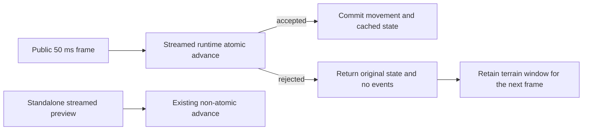
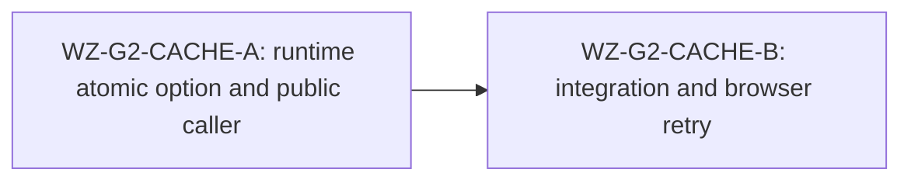

# Ticket Pack: Keep streamed terrain hot across rejected public frames

## Summary

The full-game goal requires stable long-session traversal. A source audit found that a rejected movement frame in the public Mireglass world clears its cached streamed runtime, forcing the next 50 ms frame to regenerate up to 2,304 nearby tiles. This is verified allocation churn, not yet a proven cause of prior browser crashes. Make public rejected frames atomic inside the existing streamed runtime and retain the cache when its authoritative state is unchanged. Preserve the standalone streamed preview's current rejection and gravity behavior.

## Proposed Flow

## Public Interfaces

- Extend `StreamedWorldRuntime.advance(intents, options?)` with an optional `{ atomicOnRejection?: boolean }`. Omitted options preserve the current standalone behavior, including tick and gravity on rejected inputs. When true, any rejection returns the original runtime state reference and no events, commits no pending discovery, and restores the original active terrain window if a candidate move activated another window. It may return rejection details.
- `stepStreamed` in `publicWorldRuntime.ts` uses `atomicOnRejection: true` and retains `currentStreamed = { state, runtime }` after a rejected frame, because the runtime's state remains identical to the authoritative public state. Accepted frames keep the existing commit path. Exceptions still clear cache.
- No new persistence, URL, content, or rendering surface. Keep `?publicWorld=1` and `?publicWorld=v8` live.

## Lane Graph

## Topology Audit

- One implementation lane is appropriate: interface and caller are coupled, and artificial parallelism would create overlap. An independent read-only audit already supplied the causal evidence.
- Owner files are `domain/streamedWorld.ts`, `domain/publicWorldRuntime.ts`, and their focused tests. The lane must not broaden into renderer optimization without correlated evidence.
- Review blockers: standalone preview rejection semantics change, public rejected frame advances tick/yaw/gravity or discovers a tile, repeated blocked frames regenerate chunks, accepted retry fails, discovery atomicity regresses.
- Browser crash attribution remains open. If the same long-session crash reproduces after this fix, capture browser/GPU evidence and replan rather than claiming it solved the crash.
- Dispatch verdict: PASS for one bounded implementation lane.

## Tickets

### Paste now to Implementer A

Ticket WZ-G2-CACHE-A. Role: Implementer ONLY. Branch/worktree: current `ben/wizard-playable-v2` at `/private/tmp/pa-wizard-playable-v2`; no branch, commit, push, browser, or server restart. Transport: native ephemeral subagent, no nested workers. Skills: read `auto-planner-ticket-pack` and `smallest-viable-diff` completely. Own only `engine/src/domain/streamedWorld.ts`, `engine/src/domain/streamedWorld.test.ts`, `engine/src/domain/publicWorldRuntime.ts`, and `engine/src/domain/publicWorldRuntime.test.ts`. Implement the frozen optional atomic interface above, use it in public streamed frames, and prove a rejected look+move leaves the public state exactly unchanged while a subsequent valid frame succeeds. Prove standalone default rejection still advances tick/gravity. Add a deterministic cache-reuse assertion, preferably spying on runtime construction or terrain generation, not a flaky wall-clock threshold. Stay within four files and <=220 net lines. Run focused Vitest `--maxWorkers=1`; report files, line delta, tests, no-commit receipt.

### Wait for A, then Orchestrator integration gate

Ticket WZ-G2-CACHE-B. Check exact scope and test quality, run typecheck, low-worker full suite, production build, `git diff --check`, preview HTTP, identity audit, then commit. Repeat the public blocked-move entrypoint in a fresh isolated browser or deterministic integration test if the same coordinates are easier to establish without disturbing user saves. Do not claim browser crash fixed without real long-session proof.

## Assumptions

- A public frame accepts at most one look followed by one move. Rejections are all-or-nothing at that boundary.
- The standalone streamed runtime intentionally has a different per-frame rejection contract and must retain it.
- The first user-visible game remains available during this repair; this is hardening, not a feature-completion claim.
