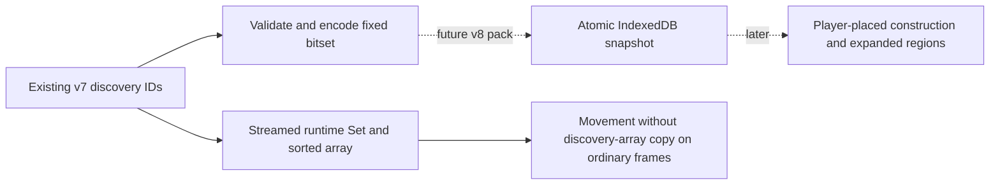
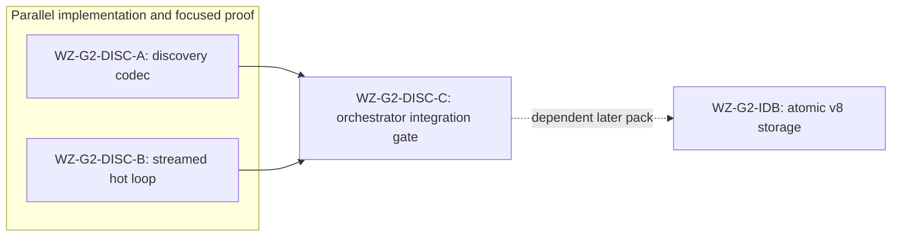

# Ticket Pack: Wizard Gate 2 discovery scale

## Summary

Goal status: aligned with `GAME_DESIGN.md`. This is a prerequisite for a full 2 km single-player RPG, not its completion. Keep the existing playable v7 world and preview untouched. A fully explored 512 by 512 grid has 262,144 discovered cells; its v7 three-copy localStorage scheme exceeds the documented 5 MiB localStorage budget. This pack makes discovery compact at the future save boundary and cheap during steady-state movement. A dependent pack will implement the IndexedDB v8 migration before permanent construction is added.

### Locked design

- Canonical world tile IDs are `tile-${gx + 3}-${gz + 3}` for grid coordinates `-256..255` on each axis.
- Persist discovery as a fixed 32,768-byte bitset in IndexedDB v8, not a second large JSON list. Keep the in-memory v7 array contract for now.
- Never alter, delete, or auto-migrate v5/v6/v7 localStorage artifacts in this pack. The current user preview remains available.
- Preserve sorted, unique discovery IDs, exact event sequence, and current tile inclusion.

### Important repo truth

- `worldChunks.ts` defines the 512 by 512 grid.
- `streamedWorld.ts` currently clones the whole discovery array every movement frame and uses linear `includes` and full sorting.
- `publicWorldRuntime.ts` reuses a streamed runtime while a player remains in streamed terrain. A different state identity rebuilds from a validated snapshot.
- `publicWorldV7.ts` retains v7 root, stage, and backup plus source receipts. It is not a scalable v8 store.

## Proposed Flow

## Public Interfaces

- New pure `discoveryMask.ts`: `DISCOVERY_MASK_BYTES`, `encodeDiscoveredTileIds(ids: readonly string[]): Uint8Array`, and `decodeDiscoveredTileIds(mask: Uint8Array): string[]`. Reject noncanonical, duplicate, unsorted, and out-of-grid IDs at encode; reject any wrong-length mask at decode. Use row-major bit index `(gz + 256) * 512 + (gx + 256)`, low bit first per byte. Decoding returns canonical v7 lexically sorted IDs.
- No change to `StreamedWorldState`, intent, event, or public save interfaces in this pack.

## Lane Graph

## Topology Audit

- Productive lanes: A owns pure encoding and round-trip tests in new files. B owns movement runtime discovery bookkeeping and focused tests in existing streamed-world files.
- Maximum safe parallel width: 2. A and B do not consume each other's artifacts or edit the same files.
- Fan-in: C consumes both receipts and the assembled checkout, then runs typecheck, focused tests, and diff review. The later v8 store must consume A's interface and C's proof.
- Broad-lane audit: each implementation lane is one bounded behavior and no dependencies; no new UI, region, or save writes are authorized.
- Certainty audit: A closes canonical reversible representation; B closes per-frame discovery allocation. C closes only integrated compatibility, not browser storage or full-game acceptance.
- Surprise trigger: a canonical tile ID mismatch, test incompatibility, or >5 files/>300 net lines in a lane forces replanning before scope expansion.
- Conditional repairs: lane-local correction for failing focused tests; any save migration or UI change is deferred to a new pack.
- Serial edge A to C: C needs codec result. Serial edge B to C: C needs runtime result. A and B have no serial edge.
- Dispatch verdict: PASS. Two independently productive, disjoint lanes converge on a narrow validation gate.

## Tickets

### Paste now to: Implementer A

Ticket: WZ-G2-DISC-A. Lane type: Parallel. Delivery phase: pr_hardening. Delivery milestone: pre_surface; current v7 preview is already SURFACE_READY and must stay stable. Shortest complete flow: encode a discovered ID set, decode the bitset, and recover the identical sorted IDs. First feedback: focused Vitest receipt. Test-writing policy: pr_hardening_required. Review blockers: noncanonical acceptance, lossy round-trip, wrong bit order, memory blowup. Validation environment: current engine checkout with `npm` installed; no environment repair authority. Surface readiness: no public UI change. Surface revision and entrypoint: existing v7 preview, unchanged. Availability: do not restart it or open browser windows. Post-surface validation: orchestrator typecheck and integration. Optional-feedback wait: never.

Branch/worktree: current `ben/wizard-playable-v2` at `/private/tmp/pa-wizard-playable-v2`; do not create or push a branch. Role: Implementer ONLY, native spawned subagent, inherited model, no nested workers. Required skills: `auto-planner-ticket-pack`, `smallest-viable-diff`. Files: add only `engine/src/domain/discoveryMask.ts` and `engine/src/domain/discoveryMask.test.ts`. Reuse `worldChunks.ts` constants and canonical IDs from `streamedWorld.ts`. Do not touch v7 storage, UI, or runtime. Expected diff: 2 files, under 220 net lines, zero deps. Acceptance: `npx vitest run src/domain/discoveryMask.test.ts --maxWorkers=1`, from `games/wizard-realms/engine`; orchestrator owns combined typecheck. Cover empty/full masks, boundaries, deterministic bit positions, canonical validation, duplicate/unsorted rejection, and encode/decode identity. Return exact files, line delta, test result, and no-commit handoff.

### Paste now to: Implementer B

Ticket: WZ-G2-DISC-B. Lane type: Parallel. Delivery phase: pr_hardening. Delivery milestone: pre_surface; current v7 preview is already SURFACE_READY and must stay stable. Shortest complete flow: a streamed player moves repeatedly on already-discovered tiles, retaining identical state/events without copying the full discovery array on every frame. First feedback: focused Vitest receipt. Test-writing policy: pr_hardening_required. Review blockers: discovery event loss, unsorted IDs, mutation of frozen snapshots, wrong current-tile validation. Validation environment: current engine checkout; no environment repair authority. Surface readiness: no public UI change. Surface revision and entrypoint: existing v7 preview, unchanged. Availability: do not restart it or open browser windows. Post-surface validation: orchestrator typecheck and integration. Optional-feedback wait: never.

Branch/worktree: current `ben/wizard-playable-v2` at `/private/tmp/pa-wizard-playable-v2`; do not create or push a branch. Role: Implementer ONLY, native spawned subagent, inherited model, no nested workers. Required skills: `auto-planner-ticket-pack`, `smallest-viable-diff`. Files: update only `engine/src/domain/streamedWorld.ts` and `engine/src/domain/streamedWorld.test.ts`. Keep all public interfaces and authority semantics. Use an internal membership Set and copy/insert sorted IDs only when a new tile is discovered; ordinary frames may reuse the already frozen array. Do not touch v7 persistence, region logic, or renderer. Expected diff: 2 files, under 180 net lines, zero deps. Acceptance: `npx vitest run src/domain/streamedWorld.test.ts --maxWorkers=1`, from `games/wizard-realms/engine`; orchestrator owns combined typecheck. Cover repeat movement without new discovery, first-visit event, sorted unique discovery, resume of validated snapshot, and rejected movement. Return exact files, line delta, test result, and no-commit handoff.

### Wait for A and B then: Orchestrator integration gate

Ticket: WZ-G2-DISC-C. Delivery phase: pr_hardening. Delivery milestone: pre_surface. Confirm disjoint receipts and scope limits, inspect full diff, run focused tests and typecheck. If accepted, run full engine tests and production build within low-RAM limits; keep current preview live. Do not equate a successful codec/hot-loop change with v8 IndexedDB migration or full-game completion. Activate a bounded repair only for a reproducible in-scope failure, otherwise author the next v8 storage ticket pack.

## Assumptions

- Browser localStorage offers 5 MiB per origin; the storage decision is based on the legal fully explored save, not only current small saves.
- IndexedDB and source-coherent v7 migration are a separate high-risk seam and require their own proof before placement gameplay.
- Current v7 test and preview state must remain reproducible throughout.
