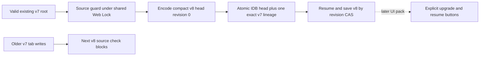
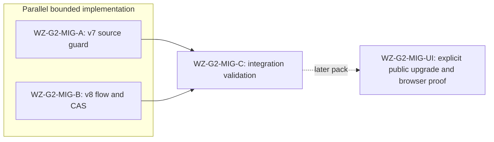

# Ticket Pack: Source-coherent Wizard v7 to v8 migration

## Summary

Goal status: aligned with the full single-player RPG in `GAME_DESIGN.md`. This is a storage-only migration seam, not game completion or public promotion. It imports an existing valid v7 world into the compact v8 IndexedDB root without modifying any v7 or older localStorage byte. Under the shared Web Lock, v8 writes fail closed if an older v7 tab advances its root.

### Locked design

- Existing v7 UI and its preview stay unchanged and playable. This pack exports domain operations only.
- Reuse `PUBLIC_V7_LOCK_NAME` for every v8 read, import, resume, and write. No lock means no operation.
- Preserve the exact v7 root bytes as the one immutable IDB lineage receipt; leave all v5/v6/v7 localStorage artifacts untouched.
- A v8 operation checks source coherence under that lock, checks a compact head's revision and full state validity, and uses the atomic IDB CAS. Never auto-select a stale head or recovery predecessor.
- No direct fresh-v8 start, UI switch, conflict reconciliation, or construction yet. New players may still start in v7 while this seam is tested.

### Important repo truth

- `publicWorldV7.ts` has exact source parsing, root loading, and artifact inspection. `loadPublicV7Root` already checks embedded v6 source bytes.
- `publicWorldV8Snapshot.ts` validates a compact typed-array head and rehydrates v7 gameplay state.
- `atomicV8Database.ts` reads opaque head/previous/lineage records and CASes them in one transaction.
- A public app tab can continue writing v7 after v8 import because old code does not know the new DB. V8 must detect that divergence at the next read/write and stop.

## Proposed Flow

## Public Interfaces

- `publicWorldV8Source.ts` exports `inspectV7SourceForV8(storage: Pick<Storage, 'getItem'>, expectedV7Bytes: string)`. Result is `{status:'same'; root:PublicV7PlayableRoot}` or `{status:'invalid-expected-source'|'invalid-v7-root'|'source-changed'|'pending-v7-stage'|'invalid-v7-backup'|'storage-error'}`. Require exact byte equality, a valid source root, no pending/invalid v7 stage, and no invalid backup. This function does not acquire the lock or write, so only the flow may call it within a held lock.
- `publicWorldV8Flow.ts` exports `PublicV8Operation<T> = {ok:true;value:T}|{ok:false;reason:string}`, `PublicV8Start = {state:PublicWorldV7State;saveRevision:number;sourceV7Bytes:string}`, `PublicV8Inspection = {status:'missing'}|{status:'valid';start:PublicV8Start}|{status:'blocked';reason:string}`, `inspectPublicV8(storage,locks,db): Promise<PublicV8Operation<PublicV8Inspection>>`, `migratePublicV7ToV8(storage,locks,db,expectedV7Bytes): Promise<PublicV8Operation<PublicV8Start>>`, `resumePublicV8(storage,locks,db,expectedRevision): Promise<PublicV8Operation<PublicV8Start>>`, and `commitPublicV8Snapshot(storage,locks,db,state,expectedRevision): Promise<PublicV8Operation<PublicV8Start>>`. `locks` uses `PublicV7LockProvider`; `db` is `ReturnType<typeof createAtomicV8Store>`. Inspection returns missing only when head, previous, and lineage are all absent. A valid head needs a matching wrapper revision, a valid lineage, and a valid previous head at revision one less when current revision is positive; revision zero needs no previous. Any orphan or malformed record is blocked. Inspection never silently falls back to v7. Migration requires IDB head/lineage absent and valid matching v7 source. Resume/commit require matching IDB record/head revisions and matching source bytes. Commit returns the new `PublicV8Start`. Errors are explicit and no source bytes are changed.

## Lane Graph

## Topology Audit

- Productive lanes: A owns exact localStorage source and artifact checks; B owns Web-Lock/IDB flow. Files do not overlap. B consumes only A's frozen signature, so both can start before A's implementation is available.
- Maximum safe parallel width: 2. The UI cannot start until B's result, and a real-browser migration proof cannot start until UI exists.
- Fan-in: C consumes both lane receipts and tests the assembled migration; it does not claim browser or player-visible proof.
- Broad-lane audit: no lane may change the v7 code, app UI, recovery choices, or construction state. Each has one bounded owner and one focused proof.
- Certainty A: can the exact v7 source be judged under staged/backup and v6-source divergence? Focused cases close it. Certainty B: can v8 import/resume/save avoid lost updates and old-tab forks? Focused fake-IDB and memory-lock cases close it. C closes type/build compatibility only.
- Surprise trigger: source bytes modified, v8 write proceeds after v7 divergence, stale revision accepted, broken lock, >5 files or >300 net lines per lane, or a preview disruption. Replan before widening.
- Conditional repair: narrow in-lane fix for a reproduced case only; public UI and branch reconciliation remain separate.
- Serial edges A -> C and B -> C supply concrete outputs. No A -> B edge because signature and status semantics are frozen above.
- Dispatch verdict: PASS.

## Tickets

### Paste now to: Implementer A

Ticket: WZ-G2-MIG-A. Lane type: Parallel. Delivery phase: pr_hardening. Delivery milestone: pre_surface, with v7 preview already SURFACE_READY. Shortest flow: inspect the exact v7 root and artifacts, returning same only for a valid unchanged root. First feedback: focused Vitest. Test-writing: pr_hardening_required. Review blockers: stale root accepted, pending stage accepted, invalid backup accepted, source mutation. Validation: current engine checkout; no environment repair authority. Surface revision/entrypoint: current v7 preview unchanged. Isolation: no browser windows/restart. Post-surface validation: combined suite and later browser upgrade journey. Optional-feedback wait: never.

Branch/worktree: current `ben/wizard-playable-v2` at `/private/tmp/pa-wizard-playable-v2`; no branch/push. Role: Implementer ONLY. Transport: native spawned subagent, inherited model, no nested workers. Required skills: `auto-planner-ticket-pack`, `smallest-viable-diff`. Add only `engine/src/domain/publicWorldV8Source.ts` and `.test.ts`. Reuse `parsePublicV7PlayableRoot`, `loadPublicV7Root`, and `inspectPublicV7Artifacts`. Expected 2 files, <=220 net lines, zero deps. Do not alter v7 or app. Acceptance: focused Vitest `--maxWorkers=1`; orchestrator typechecks. Cover exact byte equality, malformed expected bytes, v6 source divergence, pending/invalid stage, invalid backup, storage read errors, and unchanged valid source. Return files, line delta, tests, no-commit receipt.

### Paste now to: Implementer B

Ticket: WZ-G2-MIG-B. Lane type: Parallel. Delivery phase: pr_hardening. Delivery milestone: pre_surface, with v7 preview already SURFACE_READY. Shortest flow: import valid v7 bytes once, resume identical player, save a changed state, then reject a stale tab and an older v7 write. First feedback: focused Vitest. Test-writing: pr_hardening_required. Review blockers: unheld lock, source bytes overwritten, fork ignored, stale CAS accepted, invalid head accepted. Validation: current engine checkout; no environment repair authority. Surface revision/entrypoint: current v7 preview unchanged. Isolation: no browser windows/restart. Post-surface validation: combined suite and later browser upgrade journey. Optional-feedback wait: never.

Branch/worktree: current `ben/wizard-playable-v2` at `/private/tmp/pa-wizard-playable-v2`; no branch/push. Role: Implementer ONLY. Transport: native spawned subagent, inherited model, no nested workers. Required skills: `auto-planner-ticket-pack`, `smallest-viable-diff`. Add only `engine/src/domain/publicWorldV8Flow.ts` and `.test.ts`. Import the frozen `inspectV7SourceForV8` signature; do not create a local duplicate. Reuse v7 lock provider, v8 codec, and atomic store. Expected 2 files, <=300 net lines, zero deps. No UI or v7 edits. Acceptance: focused Vitest `--maxWorkers=1`; orchestrator typechecks. Cover import and exact old bytes, resume, changed-state save, stale revision/two tabs, old v7 writer after import, invalid head/lineage, lock absence, IDB abort. Return files, line delta, tests, no-commit receipt.

### Wait for A and B then: Orchestrator integration gate

Ticket: WZ-G2-MIG-C. Delivery phase: pr_hardening. Delivery milestone: pre_surface. Inspect both scopes and receipts, run typecheck, full low-RAM engine suite, production build, diff check, and exact identity before commits. Keep v7 preview up. If accepted, author the public UI upgrade pack and independently prove migration/resume in one isolated browser origin. Do not call the v8 path publicly ready before that proof.

## Assumptions

- Only a valid v7 root is imported in this pack. Other legacy/fresh entry paths remain on the existing v7 app until explicit v8 UI and migration decisions are proven.
- The v8 head currently stores v7 gameplay state; new construction state will require an explicit later schema migration.
- Fake IndexedDB closes transaction logic but not actual browser integration or long-session durability.
