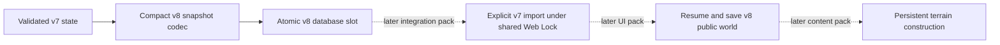
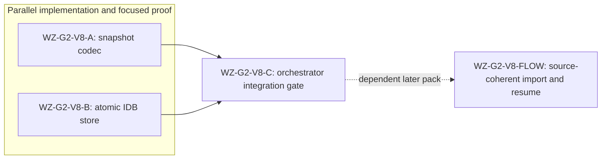

# Ticket Pack: Wizard v8 save foundation

## Summary

Goal status: aligned with the full-game contract in `GAME_DESIGN.md`. This pack prepares, but does not activate, a compact atomic IndexedDB v8 save. Existing v7 gameplay and localStorage remain authoritative until a later explicit migration-flow pack passes source-coherence and UI tests. Discovery can cover a 2 km, 512 by 512 grid without tripling an approximately 4 MiB JSON array in localStorage.

### Locked design

- Preserve every existing v5/v6/v7 localStorage byte and the v7 Web Lock name.
- In IndexedDB, retain the exact v7 source bytes only once as an immutable lineage receipt. Do not embed them in every root or create a v8 localStorage mirror.
- A v8 head has a nonnegative safe integer revision and an opaque compact snapshot. Its previous head is retained for recovery. The next head, previous head, and lineage creation publish in one `readwrite` transaction after expected-revision and expected-lineage checks.
- A failed or aborted transaction must leave the old head, previous head, and lineage unchanged. Request success is not commit success; await transaction completion.
- No public UI switch, new world objects, gameplay changes, or v7 writes in this pack.

### Important repo truth

- `discoveryMask.ts` fixes the 32,768-byte format and canonical ID order.
- `publicWorldV7.ts` already validates complete v7 state and v6 bootstrap and must remain unchanged.
- The current public app commits v7 through `publicWorldV7Flow.ts` under `PUBLIC_V7_LOCK_NAME`.
- Browser IndexedDB is an asynchronous transactional API; the later migration flow must hold the existing Web Lock while checking source bytes and committing the v8 head.

## Proposed Flow

## Public Interfaces

- `publicWorldV8Snapshot.ts` exports `PUBLIC_V8_SCHEMA = 'wizard-world/v8'`, `PublicV8Head`, `encodePublicV8Head(state: PublicWorldV7State, bootstrap: PublicV6BootstrapRoot | null, saveRevision: number): PublicV8Head`, and `decodePublicV8Head(value: unknown): { state: PublicWorldV7State; bootstrap: PublicV6BootstrapRoot | null; saveRevision: number } | null`. A head has exact keys `schemaVersion`, `saveRevision`, `bootstrap`, `state`; its `state` replaces `discoveredTileIds` with `discoveryMask: Uint8Array`. Decode validates canonical discovery and the entire v7 state. Encode throws on invalid state/revision. No retained v7 bytes in this head.
- `atomicV8Database.ts` exports `AtomicV8Record = { saveRevision: number; value: unknown }`, `AtomicV8Lineage = { sourceV7Bytes: string | null }`, `AtomicV8Read = { status: 'ok'; head: AtomicV8Record | null; previous: AtomicV8Record | null; lineage: AtomicV8Lineage | null } | { status: 'storage-error' }`, `AtomicV8Write = 'committed' | 'revision-changed' | 'lineage-changed' | 'invalid' | 'storage-error'`, and `createAtomicV8Store(factory: IDBFactory, name?: string)`. Store methods: `read(): Promise<AtomicV8Read>` and `commit(expectedRevision: number | null, expectedLineage: AtomicV8Lineage | null, next: AtomicV8Record, initialLineage?: AtomicV8Lineage): Promise<AtomicV8Write>`. The default database name is `wizard-realms:world:v8`, version 1, object store `records` with string keys `head`, `previous`, `lineage`. An initial commit requires absent head/lineage and a valid `initialLineage`; subsequent commits require the expected prior revision and same lineage and must not rewrite lineage. Validate `next.saveRevision` equals 0 for initial commit or prior revision plus one. `value` is opaque to this low-level adapter; the later flow uses the codec to validate it before write and after read.

## Lane Graph

## Topology Audit

- Productive lanes: A owns compact v8 representation and full-state validation. B owns IndexedDB atomicity and CAS, with opaque payloads. They have disjoint files and no shared mutable interface implementation.
- Maximum safe parallel width: 2. The interface above is frozen before dispatch; neither lane needs the other's output.
- Fan-in C checks types, focused and full tests, build, diff, and scope. The next flow pack consumes both A and B, so that serial edge is real.
- Broad-lane split: A is one codec; B is one transactional slot. Public migration and UI are separate later packs, not hidden in either lane.
- Certainty A: can a v7 state survive compact encode/decode with all authority facts intact? Unit round-trip and tamper proof closes it. Certainty B: do CAS and transaction abort preserve head/previous/lineage? IndexedDB-compatible tests close it. Neither test proves browser migration.
- Surprise triggers: invalid v7 state accepted, IDB abort publishes partial data, expected-revision collision, >5 files or >300 net lines per lane, a dependency beyond the permitted test-only IndexedDB shim, or a preview disruption. Replan instead of widening.
- Conditional repair: only a focused in-scope failure may activate a narrow worker repair. No migration or UI writes may be added.
- Serial edges: A -> C and B -> C each supply concrete files and test receipts. A/B have no serial edge.
- Dispatch verdict: PASS.

## Tickets

### Paste now to: Implementer A

Ticket: WZ-G2-V8-A. Lane type: Parallel. Delivery phase: pr_hardening. Delivery milestone: pre_surface, with the current v7 preview already SURFACE_READY. Shortest complete flow: validated v7 state encodes to compact v8 head and decodes to an equivalent state. First feedback: focused Vitest receipt. Test-writing policy: pr_hardening_required. Review blockers: lossy state, unvalidated mask, retained v7 bytes, nonsensical revision. Validation environment: current engine checkout; no environment repair authority. Surface gate and revision: current v7 preview unchanged. Availability: no browser windows or preview restart. Post-surface validation: orchestrator combined typecheck and full tests. Optional-feedback wait: never.

Branch/worktree: existing `ben/wizard-playable-v2` at `/private/tmp/pa-wizard-playable-v2`; no new branch/push. Role: Implementer ONLY. Transport: native spawned subagent, inherited model, no nested workers. Required skills: `auto-planner-ticket-pack`, `smallest-viable-diff`. Add only `engine/src/domain/publicWorldV8Snapshot.ts` and `.test.ts`. Reuse `discoveryMask.ts`, `isValidPublicWorldV7State`, and v6 bootstrap parser. Expected 2 files under 250 net lines, no deps. No UI, DB, or v7 source edits. Acceptance: focused Vitest with `--maxWorkers=1`; orchestrator owns typecheck. Tests cover exact shape, round-trip of real v7 state, revision/field/byte tampering, wrong mask length, and no `discoveredTileIds` stored. Return files, line delta, tests, no-commit receipt.

### Paste now to: Implementer B

Ticket: WZ-G2-V8-B. Lane type: Parallel. Delivery phase: pr_hardening. Delivery milestone: pre_surface, with current v7 preview already SURFACE_READY. Shortest complete flow: create head and lineage in one IDB transaction, then CAS a new head/previous; abort leaves prior values exact. First feedback: focused Vitest receipt. Test-writing policy: pr_hardening_required. Review blockers: partial publish, lost update, source-lineage mutation, request-success mistaken for transaction completion. Validation environment: current engine checkout; no environment repair authority. Surface gate/revision: existing v7 preview unchanged. Availability: no browser windows or preview restart. Post-surface validation: orchestrator combined typecheck and full tests. Optional-feedback wait: never.

Branch/worktree: existing `ben/wizard-playable-v2` at `/private/tmp/pa-wizard-playable-v2`; no new branch/push. Role: Implementer ONLY. Transport: native spawned subagent, inherited model, no nested workers. Required skills: `auto-planner-ticket-pack`, `smallest-viable-diff`. Add `engine/src/domain/atomicV8Database.ts` and `.test.ts`; may update only `engine/package.json` and `engine/package-lock.json` to add a pinned, test-only `fake-indexeddb` dependency if needed. The maintainer's [README](https://github.com/dumbmatter/fakeIndexedDB/blob/master/README.md) documents an in-memory IndexedDB API test implementation. No runtime dependency or other files. Expected <=4 files, <=300 net lines, one dev dependency maximum. Reuse native IDB; avoid a general database abstraction. Acceptance: focused Vitest with `--maxWorkers=1`; orchestrator owns typecheck. Tests cover fresh create, read, CAS update, stale revision, changed lineage, invalid revision, uncloneable payload/aborted transaction leaving old bytes, and separate store instances against the same database. Return files, line delta, tests, no-commit receipt.

### Wait for A and B then: Orchestrator integration gate

Ticket: WZ-G2-V8-C. Delivery phase: pr_hardening. Delivery milestone: pre_surface. Inspect scopes and receipts, run TypeScript, full engine tests with at most two workers, production build, and diff check. Keep public v7 preview available. If both lanes pass, freeze their APIs and author the dependent source-coherent v7-to-v8 flow pack. Do not claim v8 is playable or migrated at this gate.

## Assumptions

- A browser can use IndexedDB and the existing Web Lock; support and recovery will be proved in a later real-browser journey before switching public saves.
- The first v8 snapshot preserves v7 gameplay state exactly. Permanent construction is a subsequent versioned gameplay change after storage and migration proof.
- The test-only IndexedDB shim does not substitute for final browser transaction, migration, and two-tab E2E proof.
