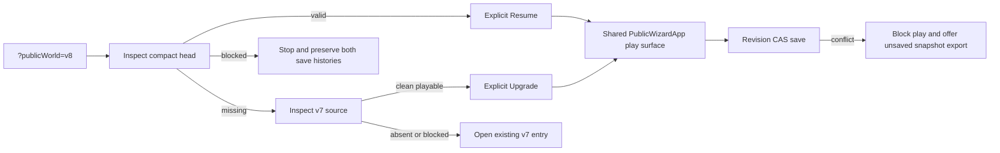
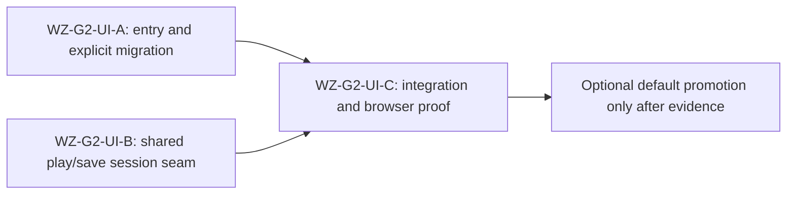

# Ticket Pack: Experimental public v8 save journey

## Summary

This is a Gate 2 storage milestone within the full Wizard Realms game goal. Make the compact v8 save path playable in a deliberately separate `?publicWorld=v8` preview, while `?publicWorld=1` remains the existing v7 game. The public v8 route must explicitly migrate a clean v7 save, resume an existing v8 save, save by revision CAS, and fail closed on conflicts. It is not a full-game completion claim or a default-route promotion.

### Locked design

- Keep the v7 entry, recovery, save, and gameplay behavior unchanged on `?publicWorld=1`.
- Reuse the existing `PublicWizardApp` gameplay surface. Add only an optional v8 session prop; do not clone the 800-line app.
- `PublicV8PlayableSession` is `{ start: PublicV8Start; commit: (state: PublicWorldV7State, expectedRevision: number) => Promise<PublicV8Operation<PublicV8Start>> }`. The entry wrapper owns `storage`, locks, and one `createAtomicV8Store(indexedDB)` instance, binds `commitPublicV8Snapshot`, and passes a stable session object after an explicit successful migration or resume.
- With a v8 session, `PublicWizardApp` initializes the world, world ref, expected revision, and v7 lineage bytes from `start`, skips v7 entry inspection, and sends saves to `session.commit`. Success advances expected revision. A failed commit blocks play, preserves in-memory state, and offers retry only for transient storage/lock failures plus an unsaved validated v7 snapshot download based on the immutable source v7 bytes. Never write the v7 root from the v8 session.
- The v8 entry first calls `inspectPublicV8`. A valid head offers explicit Resume. A missing head may offer Upgrade only after `inspectPublicV7Entry` returns an unblocked valid-playable v7 root. If v7 is missing or requires recovery, tell the player to use the v7 entry link first. A blocked v8 head or unavailable storage/lock never silently falls back to v7 or auto-restores a predecessor.
- The v8 route is experimental. Browser proof must use an isolated origin, not the user's existing `127.0.0.1` save. Keep the already-running preview available; avoid extra heavy windows.

## Proposed Flow

## Public Interfaces

- `PublicWizardApp.tsx` exports `PublicV8PlayableSession` with the exact shape above, and changes its component signature to `PublicWizardApp({ v8Session }: { v8Session?: PublicV8PlayableSession })`. No prop retains v7 behavior. The v8 session remains stable for one mounted play instance.
- `PublicV8Entry.tsx` exports `PublicV8EntryApp()` and uses `inspectPublicV8`, `migratePublicV7ToV8`, `resumePublicV8`, `commitPublicV8Snapshot`, `inspectPublicV7Entry`, and the existing `PublicWizardApp`. It must not mutate v7 storage directly. The migration operation rechecks all source bytes under the shared lock.
- The orchestrator alone changes `main.tsx` so `?publicWorld=v8` mounts `PublicV8EntryApp`, `?publicWorld=1` mounts `PublicWizardApp`, and all other routes stay as they are.
- Domain operations remain the source of truth for storage and concurrency. UI errors are explanatory labels, not independent recovery algorithms.

## Lane Graph

## Topology Audit

- Productive lanes A and B have disjoint files and consume a frozen prop contract. A adds entry wrapper and its tests; B changes the existing play/save component and its focused tests. Maximum safe parallel width is two.
- Integration C is serial after both lanes and owns the one-line route. It runs typecheck, low-RAM full tests, production build, and a fresh UI migration/resume/save/conflict journey. User access to the old preview is maintained throughout.
- No lane may alter the v7 save codec, delete or rewrite old saves, create a fresh-v8 world, or resolve ambiguous histories automatically.
- Replan if the session seam needs a broad gameplay extraction, UI work exceeds five files or 300 net lines per lane, source bytes change, old v7 route regresses, or a concrete browser failure survives two bounded repairs.
- Dispatch verdict: PASS. A and B are truly independent until the final typecheck.

## Tickets

### Paste now to Implementer A

Ticket WZ-G2-UI-A. Role: Implementer ONLY. Delivery phase: pr_hardening. Delivery milestone: experimental public surface. Branch/worktree: current `ben/wizard-playable-v2` in `/private/tmp/pa-wizard-playable-v2`; no branch, commit, push, browser, or server restart. Transport: native ephemeral subagent, no nested workers. Skills: read `auto-planner-ticket-pack` and `smallest-viable-diff` fully. Own only `engine/src/PublicV8Entry.tsx` and `engine/src/PublicV8Entry.test.ts`. Import the frozen `PublicV8PlayableSession` prop type from `PublicWizardApp.tsx`; do not edit it. Implement the explicit v8 entry behavior above, including unavailable IndexedDB/localStorage/locks and blocked v8 head. No automatic migration or fallback. Tests may exercise pure decision helpers or server-rendered entry states without adding a DOM dependency. Budget: two files, <=260 net lines, zero deps. First feedback: focused Vitest with `--maxWorkers=1`; orchestrator runs integration checks. Return changed files, line delta, tests, and a no-commit receipt.

### Paste now to Implementer B

Ticket WZ-G2-UI-B. Role: Implementer ONLY. Delivery phase: pr_hardening. Delivery milestone: experimental public surface. Branch/worktree: current `ben/wizard-playable-v2` in `/private/tmp/pa-wizard-playable-v2`; no branch, commit, push, browser, or server restart. Transport: native ephemeral subagent, no nested workers. Skills: read `auto-planner-ticket-pack` and `smallest-viable-diff` fully. Own only `engine/src/PublicWizardApp.tsx` and `engine/src/PublicWizardApp.test.ts`. Export the frozen `PublicV8PlayableSession` type and optional prop exactly as above. Initialize v8 play state from `start`, skip v7 inspection, commit by v8 revision through injected callback, keep existing v7 behavior untouched, retry transient failures, and export an unsaved valid v7 snapshot using `start.sourceV7Bytes`. Ensure v8 save failure does not fall through to v7. Add focused tests for any extracted pure decision/seam helper; browser integration comes later. Budget: two files, <=220 net lines, zero deps. First feedback: focused Vitest with `--maxWorkers=1`; orchestrator typechecks after both lanes. Return changed files, line delta, tests, and a no-commit receipt.

### Wait for A and B, then Orchestrator integration gate

Ticket WZ-G2-UI-C. Verify both receipts and overlap, wire the v8 query in `main.tsx`, run focused and full tests with bounded workers, typecheck, production build, diff and identity audit. Repeat the actual browser entrypoint using isolated `localhost` storage: v7 source, explicit Upgrade, save, reload, explicit Resume, old-tab/source conflict behavior, and download on a blocked unsaved session. Report every reproduced failure as observed error, change, restart, retry result, next action. Do not promote the default route without evidence.

## Assumptions

- Existing v7 is the only initial source for v8. New players first start on the unchanged v7 entry.
- A validated export file is an escape hatch, not an automatic restore into either save root.
- Full-game work continues after this storage milestone, including flexible construction, more connected world, mounts, economy, and long-session visual stability.
