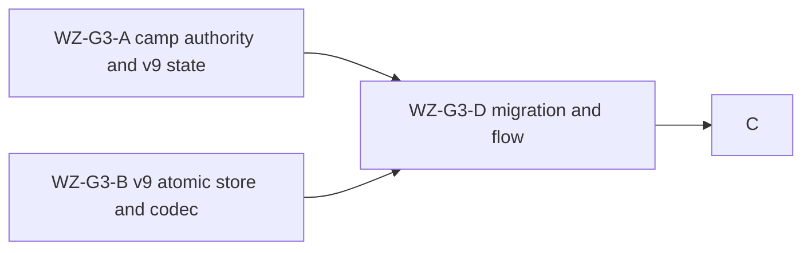

# Ticket Pack: First player-chosen, persistent field camp

## Goal and boundary

This is a delivery gate toward the full single-player RPG in `GAME_DESIGN.md`, not game completion. A player will ultimately choose a suitable discovered Mireglass cell, preview and place a camp with gathered materials, see it in the world and atlas, and retain it across reload and travel. This pack first establishes deterministic camp authority and a safe v9 save foundation. UI integration follows those contracts. Do not write a v9 camp through the exact-shape v7 or v8 codecs.

## Frozen interfaces

```ts
type PublicWorldV9State = PublicWorldV7State & {
  readonly fieldCampTileIds: readonly string[] // canonical sorted unique IDs; at most one in this revision
}
type FieldCampPlaced = {
  readonly type: 'field_camp_placed'
  readonly tileId: string
  readonly logsSpent: 4
  readonly stoneSpent: 1
  readonly xp: 30
}
type PublicV9SourceReceipt = {
  readonly sourceV8Head: PublicV8Head // full typed mask and revision, not just a digest
  readonly sourceV7Bytes: string
}
type PublicV9Start = {
  readonly state: PublicWorldV9State
  readonly saveRevision: number
  readonly sourceReceipt: PublicV9SourceReceipt
}
```

- Gameplay owns `publicWorldV9State.ts`: the type above, exact-shape validator using `isValidPublicWorldV7State` after removing only `fieldCampTileIds`, and `withFreshPublicV9Camps(v8State)` to create an empty camp list. It also owns `fieldCamp.ts`: `resolveFieldCampSite(seed, tileId)` and `applyFieldCampAction(state, tileId, bootstrap)`. The caller must supply the actual session bootstrap, including for imported worlds. The resolver must derive canonical tile coordinates from ID, not the atlas's legacy +3 grid offset. Placement checks stable dry loam, Mireglass core bounds, terrain support, authored anchors, tree/herb/route/ring occupancy, discovery, streamed ownership, physical reach, 4 logs and 1 stone, construction XP overflow, and a one-camp limit. Rejected actions return the original state reference, no event, no material spend. Cancel is UI-only and has no domain action.
- Persistence owns `publicWorldV9Snapshot.ts`: `encodePublicV9Head(state, bootstrap, saveRevision)`, `decodePublicV9Head(value)`, and portable v9 export parsing/serialization. It imports the gameplay validator; a v9 head has its own exact top-level and state key lists, including a 32 KiB typed discovery mask. Any explicit download of unsaved or blocked v9 state must be a v9 artifact, never a disguised v7 snapshot.
- Persistence owns `publicWorldV9Flow.ts` with `inspectPublicV9`, `migratePublicV8ToV9`, `resumePublicV9`, `commitPublicV9Snapshot`. It may expose a narrow `inspectPublicV8UnderLock` from `publicWorldV8Flow.ts`. All operations share `PUBLIC_V7_LOCK_NAME` without nested acquisition. The immutable receipt contains the full validated v8 head and exact v7 source bytes; every inspect, resume, and commit compares both to current source. A later v8 writer or changed v7 root blocks v9, preserving both branches. A separate v9 IndexedDB name and atomic revision/lineage CAS protect v9 head, previous, and receipt. No writes to v7 localStorage or v8 DB during migration.
- An atomic store can be generalized from v8 if its existing external contract and tests remain identical. Passing a v9 name to the current `createAtomicV8Store` is forbidden because its lineage shape and CAS are hard-coded to `sourceV7Bytes`. An isolated v9-specific store is acceptable if it is materially safer and keeps the diff smaller.
- Recovery is explicit, never silent fallback. An invalid v9 head or changed source must block normal commits. A later recovery ticket can expose archive-and-choice operations; this foundation must not overwrite corrupt records or coerce a fork into a valid save.

## Lane graph and ownership



A and B may work concurrently against the frozen interface. B must import A's type and validator, not edit A's files. D starts after B, and C starts after D. No lane may commit, push, restart preview, or touch user browser storage. The primary agent owns integration, low-RAM validation, browser proof, and correct Bioscopics Git identity.

Model routing is planner-selected for both bounded coding lanes. A needs repository code editing and deterministic gameplay tests; use the live-listed native `gpt-6.1-sol`, then independently verify state atomicity and site choice. B needs repository editing plus careful IndexedDB and codec reasoning; use the live-listed native `gpt-6-astra`, then independently verify v8 compatibility, v9 CAS, malformed records, and portable export. Native subagents share this worktree, so strict file ownership is mandatory. If either listed model is unavailable at dispatch, choose a capability-equivalent live native model without changing the lane contract; otherwise keep just that lane pending.

### WZ-G3-A, gameplay authority

Own only `engine/src/domain/fieldCamp.ts`, `fieldCamp.test.ts`, `publicWorldV9State.ts`, and `publicWorldV9State.test.ts`. Preserve v7/v8 exact validators unchanged. At least two materially different eligible cells must exist for the same seed so choice is real. Test valid placement, spoofed/wet/occupied/undiscovered/distant/duplicate sites, no partial spend or XP on rejection, event exactly once, and validation of persisted IDs. Reuse existing inventory, XP, and canonical tile primitives where practical. No UI or persistence edits.

### WZ-G3-B, atomic store and snapshot

Own only `engine/src/domain/atomicV8Database.ts`, its tests, optional new generic or v9 store files and tests, `publicWorldV9Snapshot.ts`, and its tests. Use the frozen v9 state type from A. Keep v8 behavior and tests exact. Validate typed mask bytes and exact shape on decode. Test v9 head/previous/lineage CAS, revision races, initial creation, malformed source/records, and portable export round-trip, including the full camp record. No migration flow or UI edits.

### WZ-G3-D, migration and coherence

After B, own only `publicWorldV8Flow.ts` plus focused tests and `publicWorldV9Flow.ts` plus tests. Expose the under-lock v8 inspector without changing public v8 behavior. Migrate only a fully valid v8 head and previous with unchanged v7 source, create v9 revision zero once, and test unchanged v7/v8 bytes. Test exact source comparison, old-tab advance, invalid v9 head/previous/receipt, stale revision, and failed atomic commit. No nested Web Lock requests.

### WZ-G3-C, UI and projection

After D, own explicit `?publicWorld=v9` entry and versioned session, v9 export controls, player-selected map cell and scene preview, commit/cancel, camp marker/geometry, and accessible status. Preserve `?publicWorld=1` and `?publicWorld=v8`. This lane needs a separate interface and file ownership review before dispatch because it crosses several UI owners.

## Acceptance and safety gate

First give the user an experimental v9 route without changing the default. In a fresh isolated browser origin, explicitly upgrade a valid v8 save, gather logs and stone, select two eligible cells, cancel one without spend, build the other, save, reload, leave and return, and see the same camp and inventory. Then advance the old v8 source in another tab and verify v9 blocks rather than overwrites it. Do not disturb the user's existing 127.0.0.1 save. UI availability is a milestone, not the full-game finish condition.

## Risks

The current v8 blocked-progress export emits v7 bytes and cannot represent a camp. A v9 exporter must be wired before v9 play is exposed. `worldTileAtGrid` wraps legacy +3 coordinates; atlas `gridX` is not a canonical global grid. Current stump digging grants a stone but does not generally edit terrain; persistent terrain alteration remains a later milestone. A separate v9 DB cannot protect against a raw writer that bypasses the shared Web Lock, and the design does not claim otherwise.
