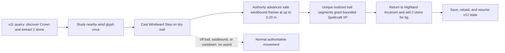
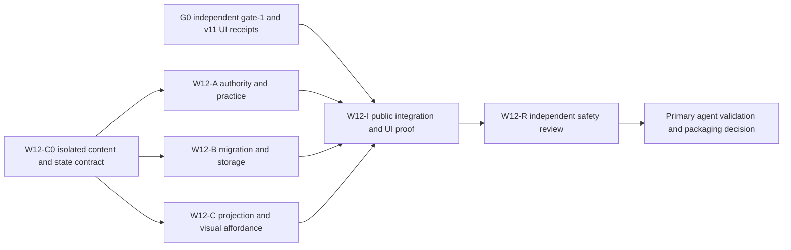

# Ticket Pack: Highland Windward Step

## Summary

This is the next small, playable gate-2 expansion toward the full single-player wizard RPG in [Game Design](GAME_DESIGN.md), not the end of that goal. The player reaches Highland Quarry on foot, studies a wind-cut glyph at Quarry Crown, extracts stone, learns and practices a second spell on the return trail, then chooses a buyer. Windward Step makes the trip back useful and visibly different without a new movement owner, item, merchant, or economy ledger.

**Player-facing integration prerequisite:** an independent tester must first finish the current Mireglass seal-cache and Bell Alder herb return in the real UI, trade, save, reload, and resume. The Highland v11 out-and-back also needs a real UI receipt. Pure content and state contracts may be prepared in isolation while those journeys run, but v12 integration and any completion claim wait for the receipts. A deterministic path test or reachable preview is not that receipt.

Locked design:

- Active for **60 simulated seconds** (`1200` ticks at 50 ms), recast after **90 simulated seconds** (`1800` ticks), movement multiplier **1.25**, assisted move capped at **0.20 m per tick**. The ordinary sampled move remains `0.16 m per tick`. No wall-clock progress or client-supplied speed.
- The benefit applies only to safe westbound travel along the canonical Highland corridor after learning the spell. Off-trail, eastbound, junction, and Greenway motion remains normal. A failed spell or frame never consumes a tick, item, coin, XP, or save revision.
- Reuse the existing `stone` item and existing buyers. Highland Arcanum buys stone for `3g` each and Greenway Outfitters for `1g` each. Do not add a quarry buyer that removes the return decision.
- Do not rewrite v7 through v11 state, source bytes, terrain, Mireglass actions, or the old `learnedSpellIds` validator, which only accepts Wayfinder Glow. The v12 overlay owns Windward Step; one authoritative player, clock, inventory, event sequence, and market remain.
- No boat, mount, stamina system, new region, online market, or endgame claim belongs in this pack.

Important repo truth: `domain/highlandContent.ts` pins a reversible 248-cell, 988 m, 4 m cardinal corridor. `domain/publicWorldV11Authority.ts` owns landmark discovery and quarry extraction. `domain/world.ts` owns existing stone prices and trade-listing settlement. `domain/streamedWorld.ts` and `domain/publicWorldRuntime.ts` own actual movement and barriers. The v11 save is an exact-key snapshot with a separate IndexedDB head, previous head, source receipt, Web Lock, and revision compare-and-swap. `PublicWizardApp.tsx` is presently owned by the Mireglass herb guidance repair and must not be edited concurrently.

## Proposed Flow

## Public Interfaces

- `PublicWorldV12State = PublicWorldV11State & { windContentRevision: 'highland-windward-step-v1'; windstep: { learned: boolean; activeUntilTick: number; nextCastTick: number; practicedRouteIndices: readonly number[] } }`. Migration initializes `false`, `0`, `0`, and `[]`. Indices are sorted, unique canonical trail-segment integers in `[21,246]`; no practice or active spell before learning; learning requires the already committed Highland landmark. Future timer values may be at most `tick + 1200` and `tick + 1800` respectively. Validate safe integer bounds, exact keys, canonical route length, and the stripped v11 state. Never infer a spell from UI state.
- Pure v12 actions: `study_windward_glyph` and `cast_windward_step`. Study requires streamed ownership, landmark discovery, canonical Crown glyph within 3D `3 m`, and not already learned. Cast requires learned spell, streamed ownership, safe trail position, cooldown completion, and safe timer addition. Successful actions emit one typed event and advance the single event sequence, not the fixed movement tick. Rejections return the identical input state reference and no event.
- `advancePublicWorldV12Frame` may scale only a finite, normal sampled move of at most `0.16 m`, with westbound alignment to the local trail tangent. Both the current and scaled destination must remain in the dry corridor envelope. Use the existing movement authority exactly once for the selected normal or scaled intent. Never bypass a terrain, collision, connector, 4 m intent, or save-pose check. If eligibility is uncertain, choose the normal intent before that call; if authority rejects, return the original v12 state with no practice or partial events. The rendered gait follows realized displacement, not the requested boost.
- Practice records a route index only when the accepted frame actually enters that previously unrecorded index while the spell is active and moving west. Crossing a known index again, holding a key, recasting, teleporting, a rejected frame, or moving east grants nothing. Award `1` Spellcraft XP for each cumulative group of `4` distinct indices, at most `56` XP over the 226 eligible segments. Every award checks total XP, skill XP, level, and event-sequence overflow and emits one practice event. A failed overflow check rejects the whole frame atomically. No caller-supplied route index or XP is accepted.
- Save schema `wizard-world/v12` in a new `wizard-realms:world:v12` database, with exact v11 head and full lineage pinned as the source receipt. Explicit v11-to-v12 upgrade validates the current source under the shared v7 Web Lock and writes only the v12 head, previous, and lineage records. Resume and commit use source comparison and revision CAS; they reject changed sources, stale revisions, invalid histories, and corrupt records without rewriting older data. Learning, cast timers, and practiced-index history must never retreat across accepted snapshots. Offer read-only validated rescue downloads, not automatic repair or import.
- The v12 projection adds a learned Windward Step label, a nearby glyph action, active and cooldown status, restrained wind feedback, and a buyer comparison after stone extraction. Preserve v11 fog and map discovery. The legacy player spell array remains unchanged; only the v12 read model combines it with the overlay. A new `?publicWorld=v12` entry offers an explicit upgrade or resume. The existing v11 entry remains available.

## Lane Graph

`W12-A`, `W12-B`, and `W12-C` are parallel after the exact state contract is landed. `W12-I` alone may edit `PublicWizardApp.tsx` and its test, and only after the herb guidance owner is finished. No worker may create a PR, merge, or use a non-Bioscopics GitHub identity on this pack's behalf.

## Topology Audit

- Productive width after `W12-C0`: three incomparable lanes, respectively authority, persistence, and presentation, with disjoint file ownership and one fixed v12 state contract. `W12-I` consumes their actual exports, then review targets cross-boundary safety.
- Serial edges are real: isolated content and state can be prepared while live gate receipts are pending; authority, persistence, and view import the C0 state; public integration waits for both the receipts and all three lanes; review needs the integrated revision. No unrelated agent or active task is interrupted for routine dispatch.
- Gate risks that require replanning: a v11 live journey still fails, a boosted step can bypass movement validation, an old source must be rewritten, a duplicate sale or XP is possible, or save-lineage size/latency grows without a bounded explanation. Otherwise keep the smallest behavior diff.
- Dispatch verdict: **C0 in progress, public integration pending G0**. This document authorizes no deployment, merge, or full-game claim.

## Tickets

**W12-C0, content and state, is underway in isolation.** Own new `engine/src/domain/highlandWindContent.ts`, `publicWorldV12State.ts`, and focused tests only. Pin the glyph to Crown, the existing route indices and local tangents, the exact overlay and validator, and the additive migration constructor. Prove fixed and varied seeds, sorted and bounded practice indices, timer bounds, no v11 mutation, and accepted old-source shape. Return file list, diff, test output, and content revision. Do not touch motion, saves, UI, or Mireglass.

**Wait for C0, then dispatch W12-A, W12-B, and W12-C in parallel:**

- `W12-A`, authority: own new `engine/src/domain/publicWorldV12Authority.ts` and tests only. Implement study, cast, one-frame assist, realized-segment practice, typed events, identity-preserving rejections, and a frozen/trusted state path. Test normal versus assisted distance on the same corridor, all boundaries and bends, blocked moves, expiry and cooldown, duplicate study/cast, no eastbound benefit, XP cap, overflow, and one tick/event sequence. Prefer the v11 movement primitive; a need to change older behavior is a tripwire, not implicit permission.
- `W12-B`, persistence: own new `publicWorldV12Snapshot.ts`, `atomicV12Database.ts`, `publicWorldV12Flow.ts`, `PublicV12Entry.tsx`, and tests. Prove explicit migration, unchanged v11 and older bytes, exact source receipt, head/previous atomicity, Web Lock, stale CAS, source drift, corrupt head, prior-head rescue, and monotonic learned/practice/timer history. Measure v11 and v12 encoded bytes plus inspect/commit latency on the same named machine. Nested full-head receipts are a known cost, not a reason to loosen source coherence silently.
- `W12-C`, presentation: own new `PublicV12WorldView.ts`, `view/contracts.ts`, `view/WizardHud.tsx`, `view/WizardScene.tsx`, and focused tests. Add a discoverable glyph, one semantic study/cast control with active/cooldown feedback, a subtle avatar wind ribbon or equivalent bounded effect, and an honest 3g versus 1g return hint. No heavy particles or audio. Do not mark hidden tiles, nodes, or stores discovered. Avoid `PublicWizardApp.tsx` while navigation work is active.

**Wait for A, B, C, and herb-owner release, then W12-I, integration.** Own `engine/src/PublicWizardApp.tsx`, its tests, `engine/src/main.tsx`, and cross-boundary tests. Connect typed intents, v12 frame, projection, entry, autosave, and exact public route. First expose an honest isolated `?publicWorld=v12` UI journey after minimum migration safety checks, then keep the user preview stable while running single-worker hardening separately. On an observed blocker, record `observed error | change | restart | retry result | next action` and repeat the same entrypoint and actions. Run focused tests, typecheck, the full one-worker suite, production build, source-byte checks, and browser final proof. A save may never be silently upgraded or reset.

**Wait for I, then W12-R, read-only review.** Check source-coherent migration, no duplicate coin or XP, no boost through barriers or world seams, no false map discovery, old-version parity, and smallest viable diff. Report severity-ordered findings, GO or NO-GO, and exact residual visual/performance risks. The primary agent owns bounded repairs and final validation; PR packaging is a later explicit decision, not automatic merge authority.

## Acceptance journey

On one preserved browser origin, explicitly upgrade a validated v11 save to v12. Starting with an owned, equipped field spade and Excavation Lv2, walk east to Quarry Crown, study the glyph in reach, extract `2` stone, cast Windward Step, and walk the known westbound trail. Compare a measured normal segment with an assisted segment at the same controls; the latter is faster but never exceeds `0.20 m/tick`. See practice progress only on new route indices. Return to Highland Arcanum near Greenway and sell both stones for exactly `6g`; Greenway Outfitters remains a `2g` alternative for two stones. Repeat the sale and verify non-mutating rejection. Also prove that stone put in one of four trade escrow slots cannot be sold again. Save during or after the spell, reload, resume the same inventory, coins, learned spell, timer, practiced indices, and world pose. Verify cooldown, expiry, fog, old save availability, and no duplicate event or revision.

Include a small-screen control and readability pass, a named-hardware long-route memory/frame sample, and v11 versus v12 save-byte and inspect/commit measurements. Keep the active chunk bound of nine and visible terrain bound of 289. If the new lineage copies cause unbounded growth or materially consume the 50 ms fixed step, stop and plan a separate compatibility-preserving lineage improvement rather than patching older schemas in place. A passing v12 slice is still not a full game or production release: flexible terrain-wide routes, boats, several more spells, distinct regions, creatures, mounts, campaign, endgame, and release proof remain.

## Assumptions

- This is one implementation pack on the existing game-specific authoritative engine, not a cross-game engine migration or a shipped model-agent runtime change.
- The current v11 corridor, Highland landmark and stone nodes, and existing market prices remain pinned. Any conflict found by the gate-1 tester returns to the observed-error repair loop before v12 dispatch.
- The parent agent coordinates worker transport, accounts, validation isolation, and any later PR. This pack is a scoped future implementation contract only.
