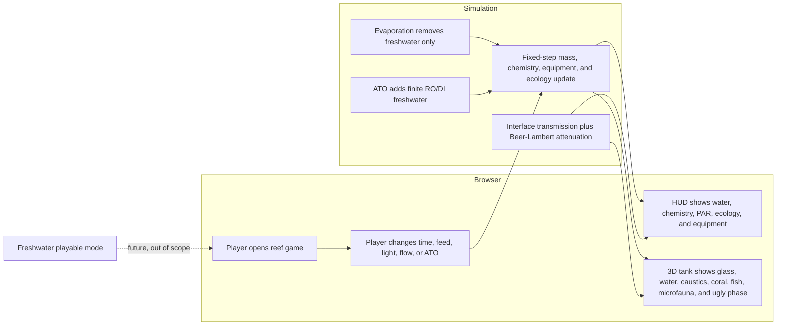
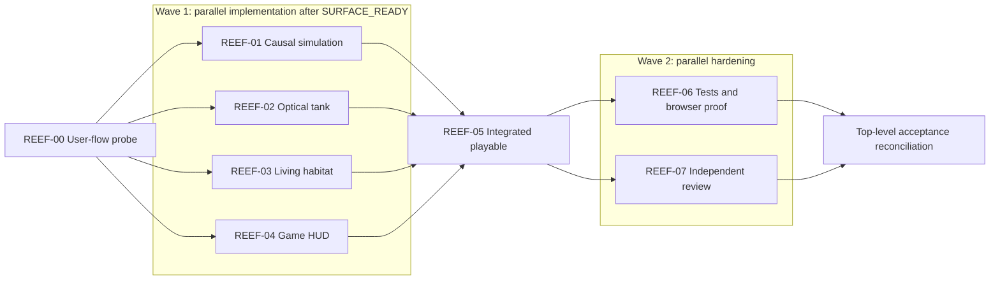

# Ticket Pack: Reef Tank Playable Vertical Slice

## Summary

Create an isolated, standalone browser game in `/Volumes/git/games/reef` that turns the accepted reef research packet into a polished first playable marine aquarium. A minimal user-flow probe establishes the real Vite and WebGL surface. Four disjoint implementation lanes then add the causal simulation, optical tank, living habitat, and game HUD before a narrow integration gate and parallel hardening gates.

Locked design:

- The executable slice is `marine_reef`; `freshwater` remains a separate typed namespace with no cross-mode livestock, chemistry, or consumables.
- Real-time optical effects are physically based approximations, explicitly named as such. No full path-tracing claim is permitted.
- Evaporation removes water but not salt. ATO adds only RO/DI freshwater from a finite reservoir.
- Existing research and `work/` artifacts are preserved.
- Procedural geometry and shaders avoid external art licensing.
- All generated prose avoids em dashes.

Important repo truth:

- `/Volumes/git/games/reef` contains completed research artifacts but no application code.
- Git currently resolves to an unrelated uncommitted repository rooted at `/Volumes/git`; the probe must create a nested repository rooted at `/Volumes/git/games/reef`.
- Node `v25.2.1` and npm `11.6.2` are available.
- Current package versions discovered from npm are Vite `8.2.2`, React `19.2.8`, Three.js `0.185.1`, React Three Fiber `9.7.0`, and Vitest `4.1.11`.

Required diff constraints:

- A greenfield game necessarily trips new-file, dependency, lockfile, and line-count thresholds. Those tripwires are approved only for the files named by this pack.
- No lane may edit the accepted research packet, source matrix, simulation parameter model, gameplay specification, or final package status.
- Post-probe implementation lanes own disjoint file families and must commit only their declared files.

## Proposed Flow

Concrete journey: open the running aquarium, advance simulation time, observe the water level fall and salt-equivalent concentration rise, enable ATO, observe the finite freshwater reservoir restore the operating level and reduce concentration, feed the tank, and observe fish response, particulates, nutrient load, microfauna activity, and coral polyp response.

## Public Interfaces

The probe creates `src/contracts.ts` as the shared compile-time contract:

- `AquariumNamespace = 'marine_reef' | 'freshwater'`
- `LifecyclePhase = 'commissioning' | 'cycling' | 'ugly_phase' | 'stabilizing' | 'young_reef'`
- `ReefSnapshot`, with `clock`, `tank`, `chemistry`, `equipment`, `ecology`, `livestock`, `lightField`, and `events` records.
- `ReefAction`, with `set_speed`, `toggle_pause`, `feed`, `set_light`, `set_flow`, `toggle_ato`, `refill_ato`, `reset`, and `set_phase_preview` variants.
- `ReefSceneProps` and `ReefHudProps`, each consuming `ReefSnapshot`; HUD also receives `(action: ReefAction) => void`.

The implementation exports:

- `src/sim/reefSimulation.ts`: `createInitialReefState`, `advanceReefState`, `applyReefAction`, and `sampleParAtDepth`.
- `src/scene/OpticalTank.tsx`: `OpticalTank`.
- `src/scene/ReefHabitat.tsx`: `ReefHabitat`.
- `src/ui/ReefHUD.tsx`: `ReefHUD`.
- `src/scene/ReefScene.tsx`: the integrated R3F scene.
- `/`: the playable route.

## Lane Graph

## Topology Audit

- Productive-lane inventory: `REEF-01` owns deterministic simulation; `REEF-02` owns optical interfaces and medium rendering; `REEF-03` owns procedural organisms and habitat; `REEF-04` owns the interactive HUD.
- Maximum parallel width: four productive lanes after the probe contract is committed.
- Incomparable lane pairs: every pair among `REEF-01`, `REEF-02`, `REEF-03`, and `REEF-04` has disjoint files and consumes only `src/contracts.ts`.
- Fan-in/convergence gate: `REEF-05` imports the four public interfaces into `App.tsx` and `ReefScene.tsx`.
- Broad-lane split audit: each productive lane has one bounded outcome, one file family, and one lane-local build or type-check receipt.
- Evidence classification: `REEF-06` adds deterministic invariant tests and fresh browser evidence; `REEF-07` performs read-only adversarial review of scientific semantics, optics claims, and rendered-system integration.
- Certainty audit: simulation equations close mass-balance uncertainty; browser proof closes visible-surface and WebGL runtime uncertainty; review targets the independent risk of overstated fidelity and research-contract drift.
- Surprise audit: a failing WebGL surface, transparent-sort collapse, salt non-conservation, cross-namespace leak, or stale screenshot triggers local replanning.
- Finisher readiness: no PR or remote packaging was requested. Top-level reconciliation consumes accepted `REEF-06` and `REEF-07` receipts.

Serial-edge justification:

| Serial edge | Exact consumed artifact | Why concurrency is impossible |
|---|---|---|
| `REEF-00 -> REEF-01..04` | Nested repo, dependency lock, Vite shell, and `src/contracts.ts` | Parallel lanes require the same committed base and fixed interfaces. |
| `REEF-01..04 -> REEF-05` | Four component exports and commits | Integration imports and composes these concrete outputs. |
| `REEF-05 -> REEF-06/07` | Integrated revision and stable browser URL | Final tests and review must target the assembled behavior. |

- Dispatch verdict: `PASS`.

## Tickets

### REEF-00

Paste now to: Implementer 0

Ticket: `REEF-00`

Lane type: Serial probe

Delivery phase: `user_flow_probe`

Delivery milestone: `pre_surface` progressing to `SURFACE_READY`

Shortest complete user flow: open `/`, see a real WebGL aquarium shell, move the camera or use one visible control, and observe the rendered tank respond.

First-feedback evidence: local URL, initial screenshot, exact interaction, console status, and network status.

Test-writing policy: `prohibited_until_pr_hardening`

Review blocking classes: unreachable entrypoint, fatal render error, misleading non-WebGL placeholder, research-file loss, or Git root outside the reef workspace.

Surface readiness gate: nested Git root is exact, dependencies install, Vite starts, `/` renders a tank and control, no fatal overlay or journey-blocking console error, and screenshot exists.

Surface revision: pending

Surface entrypoint: pending local Vite URL

Surface availability: keep the dev server running after receipt.

Post-surface validation: implementation lanes and later hardening continue without waiting for feedback.

Optional-feedback wait policy: never

Depends on: none

Branch: `main`

Worktree: `/Volumes/git/games/reef`

Base branch: none, create nested repo with `main`

Lane role: Implementer

Dispatch transport: `native_spawned_subagent`

Model: `inherited`

Cursor runtime: `not_applicable`

Existing-task routing: `not_authorized`

Existing-task evidence fields: `not_applicable`; do not contact or interrupt an existing task.

Task/thread receipt: `not_applicable`

Final fallback transport: `none`

Runtime selection rationale: a fresh native child has isolated bounded ownership and direct access to the local filesystem and browser tools.

Agent spec: frontend and WebGL scaffold implementer with Git hygiene responsibility.

Required skills: `auto-planner-ticket-pack`, `smallest-viable-diff`, `test-from-ui` in `early_smoke` mode.

Session policy: initialize once, continue the same child for corrections, do not spawn nested workers.

Required behavior:

1. Create a nested Git repository at `/Volumes/git/games/reef`, preserve all current files, and verify `git rev-parse --show-toplevel` returns that exact path.
2. Add the minimal Vite, React, TypeScript, Three.js, and R3F app plus `src/contracts.ts`, README, `.gitignore`, and lockfile. Use current compatible versions already recorded by the pack.
3. Render an honest first aquarium shell with a tank volume, substrate, simple light, responsive full-screen canvas, and one visible control. Do not add unit tests.
4. Install dependencies, run the type/build gate, start Vite, perform an early-smoke browser journey, capture a screenshot, commit the complete probe, and keep the server running.

Required files to add or update: `.gitignore`, `README.md`, `package.json`, `package-lock.json`, `index.html`, `tsconfig.json`, `vite.config.ts`, `src/main.tsx`, `src/App.tsx`, `src/contracts.ts`, `src/styles.css`.

Forbidden files: the five accepted top-level research artifacts and all pre-existing files under `work/`.

Acceptance commands: `npm install`; `npm run build`; `git rev-parse --show-toplevel`; `git status --short`; browser early smoke against the returned URL.

Smallest viable diff: greenfield shell only; new files and dependencies are approved; no extra framework, state library, design system, asset pack, test framework configuration, or backend.

Return receipt: complete implementer receipt, native child ID, branch, commit, exact files and net lines, tripwires, commands and outputs, URL, screenshot path, journey, console and network status, and confirmation that existing research files are unchanged.

### REEF-01

Paste now to: Simulation Implementer

Ticket: `REEF-01`; lane type: Parallel; phase: implementation; milestone: `SURFACE_READY`; depends on `REEF-00`.

Branch: `feature/simulation-core`; worktree: `/tmp/reef-simulation-core`; base: accepted `REEF-00` commit.

Lane role: Implementer; transport: `native_spawned_subagent`; model: `inherited`; Cursor runtime: `not_applicable`; existing-task routing and all related evidence: `not_authorized` or `not_applicable`; task receipt: `not_applicable`; final fallback: `none`.

Agent spec: deterministic conservation-law and aquarium-systems implementer. Required skills: `auto-planner-ticket-pack`, `smallest-viable-diff`. Session: initialize once, same child for follow-ups, no nested workers.

Required behavior:

1. Add only `src/sim/reefSimulation.ts` and supporting files within `src/sim/`, importing the fixed contract without modifying it.
2. Implement fixed-step state updates for evaporation, finite RO/DI ATO, salt-equivalent concentration, nitrogen processing, feed load, temperature relaxation, maturity guilds, cyano pressure, microfauna, fish satiation, coral polyp extension, and local PPFD.
3. Preserve salt mass during evaporation and ATO. Use depth attenuation, interface transmission, shading, and light intensity in local PPFD. Treat balance constants as named tunables.
4. Do not add tests in this phase.

Acceptance: `npm run build`. Visual proof: not applicable because this lane has no standalone rendered state.

Smallest viable diff: one pure simulation module and, only if unavoidable, one local constants module; no dependencies, UI, scene, tests, persistence, or species database.

Return receipt: full implementer receipt plus one numeric evaporation and ATO trace, commit, files, line counts, reuse proof, salt-conservation reasoning, build output, and no out-of-scope edits.

### REEF-02

Paste now to: Optics Implementer

Ticket: `REEF-02`; lane type: Parallel; phase: implementation; milestone: `SURFACE_READY`; depends on `REEF-00`.

Branch: `feature/optical-tank`; worktree: `/tmp/reef-optical-tank`; base: accepted `REEF-00` commit.

Lane role: Implementer; transport: `native_spawned_subagent`; model: `inherited`; Cursor runtime: `not_applicable`; existing-task routing and evidence: `not_authorized` or `not_applicable`; final fallback: `none`.

Agent spec: real-time physically based rendering and GLSL implementer. Required skills: `auto-planner-ticket-pack`, `smallest-viable-diff`. Session: initialize once, same child for follow-ups, no nested workers.

Required behavior:

1. Add `src/scene/OpticalTank.tsx` and narrowly required shader or material files under `src/scene/materials/` only.
2. Render acrylic or glass panels and water with explicit air, acrylic, and seawater IOR values, Fresnel response, wavelength-biased Beer-Lambert attenuation, surface-normal distortion, depth gradient, light shafts, and bounded caustic cues.
3. Expose a water-level response and light-power response through `ReefSceneProps`. Keep transparent sorting stable and include a visually legible reduced-feature fallback through ordinary material composition, not a second renderer.
4. Add concise code comments naming every approximation. Do not claim path tracing or modify global app/UI files.

Acceptance: `npm run build`. Visual proof is required at integration, so return a component-level screenshot only if the lane can safely mount it without editing shared files.

Smallest viable diff: reuse Three.js physical and shader materials; no postprocessing package, texture asset, external model, dependency, or test.

Return receipt: full implementer receipt, commit, files, line counts, material and shader reuse proof, approximation list, build output, and no out-of-scope edits.

### REEF-03

Paste now to: Habitat Implementer

Ticket: `REEF-03`; lane type: Parallel; phase: implementation; milestone: `SURFACE_READY`; depends on `REEF-00`.

Branch: `feature/living-habitat`; worktree: `/tmp/reef-living-habitat`; base: accepted `REEF-00` commit.

Lane role: Implementer; transport: `native_spawned_subagent`; model: `inherited`; Cursor runtime: `not_applicable`; existing-task routing and evidence: `not_authorized` or `not_applicable`; final fallback: `none`.

Agent spec: procedural 3D ecology and animation implementer. Required skills: `auto-planner-ticket-pack`, `smallest-viable-diff`. Session: initialize once, same child for follow-ups, no nested workers.

Required behavior:

1. Add `src/scene/ReefHabitat.tsx` and bounded files under `src/scene/ecology/` only.
2. Build procedural sand, porous rockwork, branching or plate coral, visibly articulated polyps, a clownfish plus small reef fish, suspended particles, copepod-like microfauna, and feeding particles.
3. Make fish, polyps, particles, diatom film, green algae, and cyanobacteria respond to snapshot values. Use deterministic seeded placement, bounded draw calls, and no external assets.
4. Convey ugly-phase succession without implying it is a mandatory calendar event. Do not implement compatibility catalogs or predator interactions in this slice.

Acceptance: `npm run build`. Visual proof is required at integration.

Smallest viable diff: procedural geometry only; no asset pipeline, physics engine, dependency, UI, simulation equations, or tests.

Return receipt: full implementer receipt, commit, files, line counts, draw-call and deterministic-placement notes, build output, and no out-of-scope edits.

### REEF-04

Paste now to: HUD Implementer

Ticket: `REEF-04`; lane type: Parallel; phase: implementation; milestone: `SURFACE_READY`; depends on `REEF-00`.

Branch: `feature/game-hud`; worktree: `/tmp/reef-game-hud`; base: accepted `REEF-00` commit.

Lane role: Implementer; transport: `native_spawned_subagent`; model: `inherited`; Cursor runtime: `not_applicable`; existing-task routing and evidence: `not_authorized` or `not_applicable`; final fallback: `none`.

Agent spec: game HUD and accessible interaction implementer. Required skills: `auto-planner-ticket-pack`, `smallest-viable-diff`, `test-from-ui` only for component-visible checks. Session: initialize once, same child for follow-ups, no nested workers.

Required behavior:

1. Add `src/ui/ReefHUD.tsx` and update only `src/styles.css` for final visual-system rules.
2. Show marine namespace, lifecycle, time, water level, `S_eq`, temperature, pH, nitrate, phosphate, local PPFD, ATO status and reservoir, fish condition, polyp extension, ugly-phase guilds, and recent causal event.
3. Provide pause, speed, feed, light, flow, ATO, refill, reset, and phase-preview controls through the fixed `ReefAction` callback. Keep labels accessible and usable by keyboard.
4. Include a concise optics disclosure identifying the rendering as a real-time approximation and explain local PPFD rather than universal PAR targets.

Acceptance: `npm run build`. Visual proof is required at integration.

Smallest viable diff: one HUD component and the shared stylesheet; no UI library, dependency, simulator changes, scene changes, chart package, or tests.

Return receipt: full implementer receipt, commit, files, line counts, accessibility notes, build output, and no out-of-scope edits.

### REEF-05

Wait for `REEF-01`, `REEF-02`, `REEF-03`, and `REEF-04`, then paste to: Integration Implementer

Ticket: `REEF-05`; lane type: Dependent; phase: implementation; milestone: `SURFACE_READY`; depends on all four parallel implementation lanes.

Branch: `main`; worktree: `/Volumes/git/games/reef`; base: the orchestrator-cherry-picked four accepted commits.

Lane role: Implementer; transport: `native_spawned_subagent`; model: `inherited`; Cursor runtime: `not_applicable`; existing-task routing and evidence: `not_authorized` or `not_applicable`; final fallback: `none`.

Agent spec: React and R3F integration implementer. Required skills: `auto-planner-ticket-pack`, `smallest-viable-diff`, `test-from-ui` in `early_smoke` mode. Session: initialize once, same child for follow-ups, no nested workers.

Required behavior:

1. Add `src/scene/ReefScene.tsx`; update `src/App.tsx`, `src/main.tsx`, and README only as needed to connect the accepted modules.
2. Run the simulation on a bounded fixed timestep, dispatch all HUD actions, and map snapshot values into optics and habitat props.
3. Configure a stable physically based renderer, camera motion, tone mapping, bounded DPR, responsive layout, loading state, and graceful WebGL error message.
4. Start Vite, complete the full early-smoke journey, capture the integrated screenshot, commit, and keep the URL available.

Acceptance: `npm run build` plus browser early smoke with no fatal console error or required request failure.

Smallest viable diff: integration seams only; do not rewrite accepted lane modules, add dependencies, tests, persistence, catalog systems, or new artwork.

Return receipt: full implementer receipt, integrated commit, files, line counts, build output, local URL, screenshot, exact journey, console and network health, and unchanged research hashes.

### REEF-06

Wait for `REEF-05`, then paste to: Hardening Implementer

Ticket: `REEF-06`; lane type: Parallel hardening; phase: `pr_hardening`; milestone: `final_complete`; depends on `REEF-05`.

Branch: `test/simulation-and-ui-proof`; worktree: `/tmp/reef-hardening`; base: accepted integrated commit.

Lane role: Implementer; transport: `native_spawned_subagent`; model: `inherited`; Cursor runtime: `not_applicable`; existing-task routing and evidence: `not_authorized` or `not_applicable`; final fallback: `none`.

Agent spec: deterministic simulation test and browser acceptance implementer. Required skills: `auto-planner-ticket-pack`, `smallest-viable-diff`, `test-from-ui` in `final_proof` mode. Session: initialize once, same child for follow-ups, no nested workers.

Required behavior:

1. Add the smallest Vitest coverage for salt conservation, evaporation concentration, finite ATO recovery, PAR depth and light response, namespace immutability, and ugly-phase contingency.
2. Run build and tests. Start an isolated Vite instance if needed, then complete the accepted browser journey with one default and one fresh input state.
3. Capture initial and final screenshots plus console and failed-network evidence under `work/ui-evidence/` without modifying production behavior.

Acceptance: `npm test -- --run`; `npm run build`; browser final proof.

Smallest viable diff: tests and evidence only; no product repairs unless a specific product blocker is reported for a pre-authored repair decision.

Return receipt: full implementer receipt, test commit and files, exact outputs, URL, inputs, screenshots, console and network state, and PASS, FAIL, or ENVIRONMENT_BLOCKED verdict.

### REEF-07

Wait for `REEF-05`, then paste to: Reviewer

Ticket: `REEF-07`; lane type: Parallel hardening; phase: `pr_hardening`; milestone: `SURFACE_READY`; depends on `REEF-05`.

Lane role: Reviewer; transport: `native_spawned_subagent`; model: `inherited`; Cursor runtime: `not_applicable`; existing-task routing and evidence: `not_authorized` or `not_applicable`; final fallback: `none`.

Agent spec: findings-first reef-simulation and WebGL reviewer. Required skills: `auto-planner-ticket-pack`, `smallest-viable-diff`. Session: read-only, no file changes, no nested workers.

Certainty contract: determine whether the integrated slice materially violates mass balance, namespace separation, optics-claim honesty, accepted interface contracts, visual-system completeness, or smallest viable diff. Stop at decision-sufficient GO or severity-ordered NO-GO. A scientific claim not grounded in the packet, salt creation or loss, or broken rendered journey is a surprise trigger.

Required review:

1. Compare the integrated code and screenshot against the aligned implementation problem and accepted research contracts.
2. Inspect evaporation, ATO, `S_eq`, PPFD, ugly-phase, cyano, polyp, microfauna, and mode-boundary semantics.
3. Inspect optics code for explicit real-time approximation boundaries and coherent use of IOR, Fresnel, attenuation, refraction, water-surface distortion, and depth cues.
4. Inspect integration for transparent-sort, performance, accessibility, fatal runtime, and unnecessary dependency or abstraction risks.

Required output: GO or NO-GO; severity-ordered findings with file and line; pass/fail for every review item; topology, smallest-diff, reuse, deletion, and tripwire verdicts; residual risks; testing gaps; reviewed revision; and confirmation no files were changed.

## Assumptions

- The available local browser supports WebGL2. A graceful error state remains required.
- Current npm versions listed above are mutually compatible; `npm install` is the discriminating probe.
- The first playable uses a 284 L nominal display and roughly 246 L operating volume as tunable demo values, not universal husbandry rules.
- A single proposed merge unit, the nested reef game repository, is sufficient. No PR packaging lane is required.
