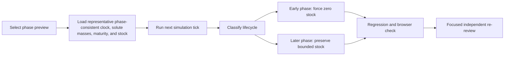

# Corrective Ticket: Running Lifecycle Stocking Invariant

## Summary

Close the final `RRF-07` finding: a later-phase preview must not become a stocked cycling tank on the next unpaused simulation tick. This is one atomic behavior contract, so no artificial parallel implementation lane is created. One bugfixer owns the simulation change and its regression test; the existing independent reviewer remains the final gate.

Locked design:

- `commissioning`, `cycling`, and `ugly_phase` never retain fish or coral after any action or state advance.
- `stabilizing` and `young_reef` phase previews load representative, explicitly non-physical demo state whose clock, chemistry, maturity, and livestock remain internally consistent on the next running tick.
- A defensive advance-time gate removes livestock whenever automatic lifecycle classification returns an early phase.
- No contract, UI, habitat, optics, dependency, or research change.
- All prose avoids em dashes.

## Flow

## Ticket LCF-01

Bugfixer only. Own `src/sim/reefSimulation.ts` and `src/sim/reefSimulation.test.ts` at final repaired head `20529cccb43d3d28dc53bb247e55b5c498d44db7`.

Required behavior:

1. Make every `set_phase_preview` preset internally consistent enough that one and many normal state advances do not immediately reclassify it to a different phase solely because the preset retained commissioning clock or chemistry.
2. When automatic classification returns `commissioning`, `cycling`, or `ugly_phase`, force livestock counts and coral health to zero before returning the next snapshot.
3. When it returns `stabilizing` or `young_reef`, preserve the bounded phase-profile stock.
4. Treat preview chemistry/clock replacement as an explicit demo-state operation, not a physical water operation. Keep its event text honest.
5. Add regression tests that advance every phase preview while unpaused, assert early phases remain unstocked, assert later phases remain later and stocked, and assert an artificially inconsistent stocked-cycling state is stripped on the next advance.
6. Run `npm test -- --run`, `npm run build`, and a narrow browser check on a new port: select young reef, resume, wait through several ticks, and confirm the phase and fish remain consistent with no console error.

Smallest viable diff:

- Two existing files only.
- Reuse lifecycle classifier, phase profile, chemistry derivation, and livestock-zero helpers.
- No new exported contract, dependency, helper file, UI change, scene change, or unrelated test.
- Stop if stable preview state requires widening beyond simulation and its test.

## Ticket LCF-02

Reviewer only after `LCF-01`. Re-evaluate the one remaining finding on the new head, confirm all earlier closures remain unaffected by the two-file diff, and return GO or NO-GO.

## Topology Audit

This corrective behavior is atomic. Parallel implementation would overlap the same lifecycle transition and regression contract, so the non-linear substantive-pack invariant does not apply and artificial fanout is forbidden. The independent review is a downstream evidence gate, not a fabricated productive sibling.
